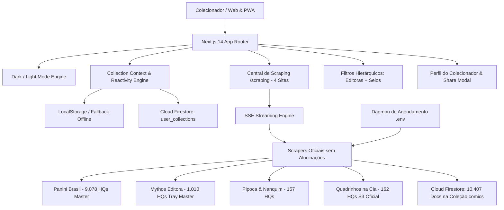

<div align="center">

# 🎬 ComixFlix
### O Streaming dos Quadrinhos Físicos • The Streaming Hub for Physical Comics

[](https://antigravity.google)
[](https://deepmind.google/technologies/gemini/)
[](https://firebase.google.com/)
[](https://williamdevide.github.io/antigravity.comixFlix/)
[](https://vercel.com/new/clone?repository-url=https%3A%2F%2Fgithub.com%2Fwilliamdevide%2Fantigravity.comixFlix&project-name=comixflix&repository-name=antigravity.comixFlix)

<br/>

[🚀 **Acessar Demo no GitHub Pages**](https://williamdevide.github.io/antigravity.comixFlix/) • [**Português**](#-visão-geral-pt-br) • [**English**](#-overview-en) • [**Repositório GitHub**](https://github.com/williamdevide/antigravity.comixFlix)

</div>

---

## 🇧🇷 Visão Geral (PT-BR)

O **ComixFlix** é uma plataforma web/PWA mobile-first para descoberta, organização e gestão de coleções de quadrinhos físicos no mercado brasileiro, sincronizado diretamente com o **Google Cloud Firestore** (`antigravitycomixflix`) e alimentado por scraping automatizado das lojas oficiais da **Panini Comics**, **Mythos Editora**, **Pipoca & Nanquim** e **Quadrinhos na Cia (Companhia das Letras)**.

Inspirado na experiência cinematográfica de plataformas de streaming (Netflix, Comixology e Letterboxd) e com design system validado no **Google Stitch**, o ComixFlix transforma listas dispersas em uma biblioteca visual com **10.407 edições oficiais reais** catalogadas com capas de alta definição master 100% autênticas, fichas técnicas completas, subfiltro de selos editoriais (Marvel, DC, Bonelli, Dark Horse, MSP, Planet Manga, etc.), controle em 1 toque dos status **Quero**, **Tenho** e **Li**, suporte nativo a temas **Dark e Light**, e Central de Scraping dedicada.

### 🌟 Principais Funcionalidades
- **Experiência Cinematográfica de Abertura:** Intro com vídeo cinematográfico (`cinematic_intro.mp4`) contido na proporção de tela, tela estática de splash (`splash.jpg`) e transição imersiva com o icônico som Tudum e contagem regressiva visual para login existente e modo visitante.
- **Autenticação Multi-Provedor no Firebase:** Login com Conta Google em 1 clique (`GoogleAuthProvider`), E-mail e Senha com recuperação via link, e Modo Visitante ("Entrar sem Conta") com acesso instantâneo ao catálogo.
- **Ações Rápidas nos Quadrinhos com Faixa Escura:** Controles rápidos na base dos quadrinhos (`Wishlist`, `Estante`, `Lido` e `Ver Mais`) sobre uma faixa escura sólida (`backdrop-blur-md` e borda sutil), garantindo alto contraste e legibilidade perfeita mesmo em capas brancas ou hipercoloridas.
- **Persistência em Nuvem no Cloud Firestore:** Catálogo completo de **10.407 quadrinhos oficiais** e metadados de sincronização gravados na coleção `comics` e `system/metadata` no Cloud Firestore, com isolamento multi-usuário em `user_collections/{uid}` e fallback offline em `localStorage`.
- **Acervo 100% Autêntico e Deduplicado (+10.400 edições):**
  - **Panini Comics:** 9.078 edições (incluindo catálogo completo do Venom e lançamentos 2025/2026 com capas oficiais em alta definição).
  - **Mythos Editora:** 1.010 edições com capas master de alta resolução e correção de acentuação (*Pré-Venda*).
  - **Pipoca & Nanquim:** 157 edições.
  - **Quadrinhos na Cia (Companhia das Letras):** 162 edições oficiais.
- **Subfiltro Dinâmico de Selos (Imprints):** Ao selecionar qualquer editora, uma sub-barra hierárquica é aberta dinamicamente permitindo filtrar por Marvel Comics, DC Comics, Sergio Bonelli Editore, Dark Horse, 2000 AD, MSP, Planet Manga, etc.
- **Central de Scraping Dedicada no Menu (`/scraping`):** Painel com 4 cards granulares por editora exibindo métricas em tempo real de **Já tem na base**, **Encontrou no site** e **Faltam importar**, streaming SSE de progresso e terminal de logs ao vivo.
- **Perfil do Colecionador com Design Stitch (`/perfil`):** Nível 5 Curador com anel gradiente, insígnias de conquistas (Mestre Mutante, Morcego de Gotham, etc.), card de Patrimônio Estimado com botão de olho para ocultar/mostrar valor privativo (`R$ ••••••`), ritmo de leitura e distribuição por universo.
- **Compartilhamento Social:** Exportação da coleção nos formatos **Instagram Stories (9:16)** e **Banner Twitter / Discord (16:9)** com estatísticas e identidade visual cinematográfica.
- **Páginas Institucionais & Legais:** Termos de Uso (`/termos`), Política de Privacidade e LGPD (`/privacidade`), e Sobre Nós da Desenvolvedora **Milkfed Devs&&Reqs Lords** (`/sobre`).
- **PWA & Favicon Otimizados:** Ícones de alta resolução `icon-192.png`, `icon-512.png` e `favicon.ico` autênticos.
- **Página de Séries & Detecção de Lacunas (`/series/[slug]`):** Visualização cronológica da run com completude percentual e alerta inteligente de volumes faltantes.
- **Agendamento Programável via `.env`:** Configuração de horário diário (`SCRAPER_SCHEDULE_TIME="03:00"`) e intervalo de recorrência (`SCRAPER_INTERVAL_HOURS="24"`).

---

## 🏛️ Arquitetura do Sistema



---

## ⚡ Guia Rápido de Execução

### No Windows (1 Clique)
Execute o script em lote na raiz do repositório:
```cmd
executar.bat
```

### Via Terminal
```bash
# 1. Instalar dependências
npm install

# 2. Executar build de produção
npm run build

# 3. Iniciar servidor
npm run start
```
Acesse a aplicação em: `http://localhost:3000`.

### Verificação do Cloud Firestore
Para verificar a integridade e contagem em tempo real no Cloud Firestore:
```bash
node scripts/verify_firestore_count.js
```

### 🌐 Deploy em Produção

#### 1. GitHub Pages (Ativo e no Ar)
A aplicação está implantada e funcional publicamente no GitHub Pages:
- **URL Ao Vivo:** [https://williamdevide.github.io/antigravity.comixFlix/](https://williamdevide.github.io/antigravity.comixFlix/)
- Build estático com catálogo universal de 10.4k edições em `/data/scraped-catalog.json`.
- Para atualizar o deploy no GitHub Pages via terminal:
  ```bash
  npm run deploy:gh-pages
  ```
- Ou via CI/CD automático em `.github/workflows/deploy-gh-pages.yml`.

#### 2. Vercel (1 Clique ou GitHub Integration)
O projeto está 100% pronto para deploy na Vercel com suporte completo ao Next.js 14 App Router e rotas SSE:
1. Clique no badge **Deploy with Vercel** no topo do README ou acesse [vercel.com/new](https://vercel.com/new).
2. Conecte ao repositório GitHub `williamdevide/antigravity.comixFlix`.
3. Em **Environment Variables**, adicione as variáveis do Firebase (`NEXT_PUBLIC_FIREBASE_*`).
4. Clique em **Deploy** — sua aplicação estará online com HTTPS automático, Serverless Functions e CDN global!

---

## 🇺🇸 Overview (EN)

**ComixFlix** is a mobile-first web/PWA streaming-like platform to discover, organize, and manage physical comic book collections in the Brazilian market. Synchronized directly with **Google Cloud Firestore** (`antigravitycomixflix`) and powered by automated scrapers connecting to the official stores of **Panini Comics**, **Mythos Editora**, **Pipoca & Nanquim**, and **Quadrinhos na Cia (Companhia das Letras)**.

Over **10,400 authentic editions** cataloged with high-resolution master covers, hierarchical imprint filters (Marvel, DC, Bonelli, Dark Horse, MSP, Planet Manga), real-time SSE scraping center, social collection export, and multi-user cloud synchronization.

### 🌟 Key Highlights (v2.5.5)
- **Cinematic Experience:** High-impact video intro (`cinematic_intro.mp4`), splash screen backdrop (`splash.jpg`), and immersive Tudum audio transition with visual countdown.
- **Firebase Multi-Auth:** 1-click Google Sign-In, Email/Password authentication with password recovery, and frictionless Guest Mode.
- **High-Contrast Comic Card Quick Actions:** Solid dark backdrop bar (`backdrop-blur-md`) providing crisp visibility for Wishlist, Library, Read, and Details icons over any comic cover art.
- **Institutional & Legal Pages:** Terms of Service (`/termos`), Privacy Policy (`/privacidade`), and Developer About Page (`/sobre`) for **Milkfed Devs&&Reqs Lords**.
- **PWA & Production Ready:** High-res PWA icons, complete offline fallbacks, and zero-error builds.

### 🔗 Repository
GitHub: [https://github.com/williamdevide/antigravity.comixFlix](https://github.com/williamdevide/antigravity.comixFlix)

---

*Developed with technical excellence using Google Antigravity v2.5.5 and Gemini 3.8 Flash.*
