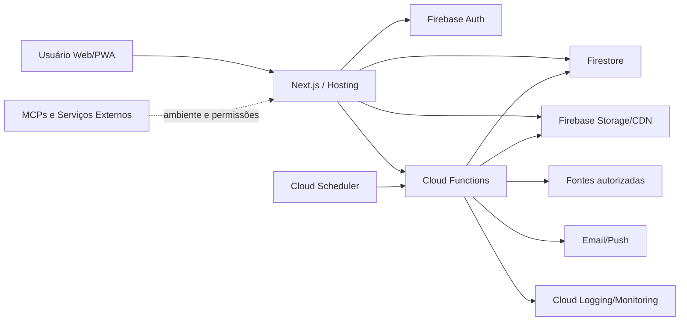
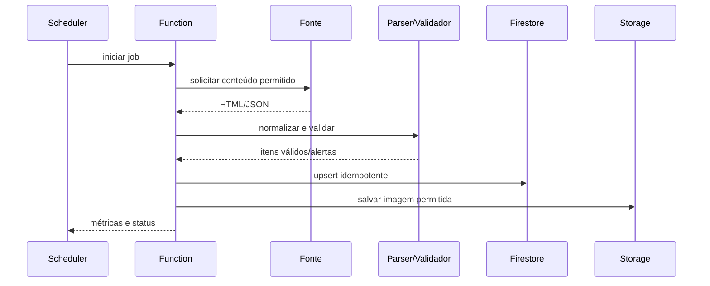

# ComixFlix — Projeto Definitivo Completo

## 1. Identificação e controle do documento

| Campo | Valor |
|---|---|
| Produto | ComixFlix |
| Tipo | Plataforma web/PWA para descoberta e gestão de coleções de quadrinhos |
| Documento | Especificação técnica, funcional, operacional e documental |
| Versão | 1.2.0 |
| Status | Proposta pronta e em execução contínua |
| Idioma | Português do Brasil |
| Fonte primária | `1.ideia-projeto.md` |
| Instruções aplicadas | `2.instrucao-projeto.md` |
| Documentação complementar | `documentation/` |

Este documento é a fonte de verdade do produto. Mudanças devem ser registradas em decisões arquiteturais e refletidas nos documentos relacionados.

## 2. Resumo executivo

O ComixFlix é uma plataforma web/PWA mobile-first para descobrir, organizar e acompanhar coleções de quadrinhos físicos. O catálogo é alimentado por rotinas de coleta das páginas oficiais da Panini Comics, Mythos Editora, Pipoca & Nanquim e Quadrinhos na Cia (Companhia das Letras), com classificação de selos editoriais (Marvel, DC, Bonelli, Dark Horse, 2000 AD, MSP, Planet Manga, etc.), capas originais em alta definição e preços atualizados sem alucinação de dados.

O usuário consulta capas, preços, promoções, disponibilidade, lançamento, sinopse, autores, personagens e demais dados disponíveis. Também marca edições como desejadas, possuídas ou lidas, segue séries, identifica lacunas, recebe alertas, consulta estatísticas e pode compartilhar partes da coleção.

O MVP prioriza catálogo unificado de 4 editoras, subfiltro de selos, busca avançada, detalhes, autenticação, status pessoais, wishlist, coleção, séries seguidas, gap detection, PWA, exportação básica e operação documentada. OCR, recomendações avançadas, gamificação, rede social completa, leitor digital, marketplace e valuation de mercado ficam como evoluções controladas.

## 3. Visão do produto

### 3.1 Problema

Colecionadores consultam diversas editoras, lojas, planilhas e memórias para descobrir lançamentos, controlar aquisições, acompanhar séries e saber o que já leram. As informações são fragmentadas, inconsistentes e pouco visuais.

### 3.2 Proposta de valor

O ComixFlix reúne catálogo e coleção pessoal em uma biblioteca visual, pesquisável, atualizada e orientada a ações rápidas.

### 3.3 Diferenciais

- Catálogo voltado ao mercado brasileiro.
- Experiência de navegação inspirada em serviços de streaming.
- Cadastro de status sem formulários extensos.
- Acompanhamento de séries e revistas mensais.
- Detecção de lacunas e percentual de completude.
- Alertas de lançamento e promoção.
- Exportação da coleção e perfil público opcional.

### 3.4 Posicionamento e comercialização

A hipótese inicial é um produto gratuito ou freemium. Recursos pagos futuros podem incluir alertas avançados, exportações premium, relatórios para seguro, estatísticas ampliadas, personalização e parcerias de afiliados. Não tratar essas hipóteses como mercado validado; validar com usuários e editoras.

## 4. Problema, oportunidade e proposta de valor

### Oportunidade

O fluxo atual de descoberta e controle de quadrinhos é fragmentado. Uma base única com filtros, status e acompanhamento de séries pode reduzir esforço e gerar retorno recorrente por meio de novidades e promoções.

### Hipóteses a validar

- Colecionadores desejam acompanhamento de edições faltantes.
- Alertas de preço aumentam retenção.
- Capas e rows visuais facilitam descoberta.
- Catálogo brasileiro é uma lacuna percebida.

Não inventar dados de mercado. Validar por entrevistas, analytics, testes de usabilidade e taxa de retorno.

## 5. Público-alvo e perfis

| Perfil | Necessidade | Prioridade |
|---|---|---|
| Visitante | Descobrir e consultar edições | Alta |
| Colecionador iniciante | Registrar coleção rapidamente | Alta |
| Colecionador recorrente | Acompanhar séries e lacunas | Alta |
| Leitor | Registrar leituras e notas | Média |
| Usuário social | Compartilhar coleção/wishlist | Média |
| Operador de catálogo | Monitorar coleta e qualidade | MVP operacional |
| Administrador | Governar acessos e configuração | Restrito |

## 6. Objetivos de negócio e métricas

### Objetivos do MVP

- Disponibilizar catálogo inicial de três fontes.
- Permitir encontrar uma edição em poucas interações.
- Permitir registrar status pessoal de forma rápida.
- Criar hábito de acompanhamento de séries.
- Demonstrar valor comercial e recorrência.

### Métricas

- Tempo para encontrar uma edição.
- Taxa de conclusão da primeira ação pessoal.
- Edições adicionadas por usuário ativo.
- Séries seguidas.
- Uso de busca e filtros.
- Retorno após alerta.
- Falhas por fonte.
- Latência e disponibilidade.
- Taxa de erro em ações pessoais.

## 7. Escopo do produto

### 7.1 MVP

- Catálogo de edições.
- Coleta agendada e disparada.
- Normalização, validação e deduplicação.
- Firebase Auth.
- Firestore e Storage.
- Home e exploração.
- Busca, filtros e ordenação.
- Detalhes completos.
- Status Quero, Tenho, Li e Lendo se mantido habilitado.
- Wishlist.
- Coleção pessoal.
- Séries seguidas.
- Pull list básico.
- Gap detection básico.
- Estatísticas essenciais.
- Dark/light mode.
- PWA e cache básico.
- Exportação CSV/JSON.
- Logs, alertas e documentação operacional.
- `.env-example` e validação de ambiente.

### 7.2 Versão comercial inicial

- Alertas de preço e lançamento.
- Push/email com consentimento.
- Perfil público e wishlist compartilhável.
- Exportação PDF para seguro.
- Melhorias de recomendações e qualidade de catálogo.

### 7.3 Evoluções

- OCR e código de barras.
- Recomendações por IA.
- Gamificação.
- Feed social.
- Integrações afiliadas.
- Leitor digital.
- Valuation com fonte externa confiável.

### 7.4 Fora de escopo

- Compra dentro da aplicação.
- Marketplace próprio.
- Leitor digital no MVP.
- Scraping de fontes que proíbam ou não permitam a atividade.
- Valor de mercado apresentado como dado oficial sem fonte.

## 8. Funcionalidades e módulos

1. Ingestão de catálogo.
2. Normalização e reconciliação.
3. Qualidade e origem dos dados.
4. Autenticação e perfis.
5. Busca e descoberta.
6. Coleção, wishlist e leitura.
7. Séries, pull list e lacunas.
8. Estatísticas e gamificação futura.
9. Alertas e notificações.
10. Exportação e backup.
11. Operação, auditoria e observabilidade.
12. Configuração de ambiente e integrações.

## 9. Requisitos funcionais

Cada requisito deve permanecer rastreável por ID, prioridade, ator, pré-condições, fluxo, exceções, entradas, resultado, dependências e aceitação.

### RF-001 — Coletar catálogo

- **Prioridade:** Alta.
- **Ator:** Job de catálogo.
- **Descrição:** Coletar dados públicos de fontes configuradas usando estratégia permitida.
- **Aceitação:** Dado um job autorizado, quando a fonte responder, então itens válidos são normalizados e gravados com origem e timestamps.
- **Falhas:** retry com backoff, log e alerta.

### RF-002 — Deduplicar e atualizar

Usar URL canônica, ISBN, ID da fonte e combinação normalizada de título/editora/edição. Não usar somente título.

### RF-003 — Consultar catálogo

Exibir cards e detalhes com título, capa, editora, preço, disponibilidade, origem e informações disponíveis.

### RF-004 — Buscar e filtrar

Filtros por editora, personagem, série, data, preço, disponibilidade e formato. Ordenação por relevância, preço, data e título. Resultados paginados.

### RF-005 — Exibir detalhes

Exibir sinopse, autores, páginas, ISBN, preços, origem, disponibilidade, tags, relacionados e link externo quando disponíveis.

### RF-006 — Autenticar

Google, Apple e email/senha, conforme configuração. Preservar contexto da ação após login.

### RF-007 — Gerenciar status

Quero, Tenho, Li e Lendo. Ações idempotentes, feedback imediato e privacidade por usuário.

### RF-008 — Gerenciar wishlist

Adicionar/remover, definir prioridade, preço alvo e notificações conforme habilitado.

### RF-009 — Gerenciar coleção

Adicionar/remover edição e registrar condição, preço pago, local e data como dados opcionais.

### RF-010 — Registrar leitura

Marcar lido, nota de 1 a 5, data e comentário futuro opcional.

### RF-011 — Seguir série

Seguir/deixar de seguir, configurar notificações, exibir próximas e faltantes.

### RF-012 — Detectar lacunas

Comparar edições identificadas com edições possuídas. Não classificar como faltante item de identidade incerta.

### RF-013 — Pull list

Gerar lista baseada em séries seguidas, incluindo lançamentos futuros e itens faltantes.

### RF-014 — Estatísticas

Agregar edições, status, séries, editoras, personagens, páginas, aquisições e valor declarado.

### RF-015 — Notificações

Notificar lançamentos, promoções e preço alvo quando canal e consentimento existirem.

### RF-016 — Exportar

CSV e JSON no MVP. PDF em evolução. Exigir autenticação e respeitar privacidade.

### RF-017 — Perfil público

Ativação explícita. Valor e wishlist privados por padrão.

### RF-018 — Operar coletas

Operador autorizado consulta status de runs, contagem, falhas, qualidade e reprocessamento.

### RF-019 — Configurar ambiente

Aplicação e jobs devem carregar configurações externas por variáveis de ambiente. Variáveis obrigatórias devem ser validadas antes de iniciar funcionalidades dependentes.

### RF-020 — Integrar MCPs e serviços

Quando MCPs ou serviços externos forem disponibilizados, utilizar seus conectores conforme permissões, sem embutir credenciais no código e com fallback quando não configurados.

## 10. Requisitos não funcionais

| ID | Requisito | Meta inicial |
|---|---|---|
| RNF-001 | LCP | < 2,5 s em páginas principais |
| RNF-002 | CLS | < 0,1 |
| RNF-003 | TTFB | < 600 ms nas páginas públicas sob carga definida |
| RNF-004 | Disponibilidade | 99,5% inicial, excluindo manutenção planejada |
| RNF-005 | Acessibilidade | WCAG 2.2 AA quando aplicável |
| RNF-006 | Segurança | Least privilege, regras testadas e nenhum segredo no cliente |
| RNF-007 | Escalabilidade | Paginação, limites, cache e agregações |
| RNF-008 | Observabilidade | Logs, métricas, tracing/erros e alertas |
| RNF-009 | Privacidade | Minimização, consentimento, acesso, exportação e exclusão |
| RNF-010 | Compatibilidade | Navegadores modernos mobile e desktop |
| RNF-011 | Recuperação | Backup e restauração testados |
| RNF-012 | Manutenibilidade | Código TypeScript, adapters, testes e documentação |
| RNF-013 | Internacionalização | Preparar textos, moeda, datas e expansão |
| RNF-014 | Custo | Monitorar consultas, Functions, Storage e serviços externos |

## 11. Regras de negócio

- Todo item coletado deve manter `source`, timestamps e URL de origem.
- Preço promocional deve ser nulo quando não existir e não pode ser maior que o normal sem justificativa.
- Dados ausentes não podem ser inventados.
- Status pessoais são separados do catálogo público.
- Tenho não implica Li.
- Lacunas dependem de identidade/numeração confiável.
- Falha de coleta não remove automaticamente catálogo válido.
- Excluir conta deve remover ou anonimizar dados conforme política.
- Perfil público exibe somente campos autorizados.
- Usuário não pode declarar `user_id` de outro usuário em escrita.
- Jobs devem ser idempotentes e reprocessáveis.
- Configurações sensíveis nunca são persistidas no cliente.

## 12. Casos de uso e fluxos principais

### UC-01 — Descobrir edição

Home → lançamento → card → detalhes → ação pessoal ou site externo.

### UC-02 — Organizar coleção

Login → edição → Tenho → dados opcionais → atualização de coleção e estatísticas.

### UC-03 — Acompanhar série

Série → Seguir → notificações → pull list → lacunas.

### UC-04 — Coletar catálogo

Scheduler → Function → fonte → parser → normalizador → validador → upsert → Storage → métricas/alerta.

### UC-05 — Inicializar ambiente

Copiar `.env-example` → preencher variáveis autorizadas → validar startup → habilitar integrações configuradas → apresentar fallback para as demais.

## 13. Critérios de aceitação

- Todas as ações críticas funcionam por teclado, toque e clique.
- Usuário anônimo navega pelo catálogo público.
- Dados pessoais não são acessíveis por outro usuário.
- Coleta falha sem apagar catálogo válido.
- Job pode ser reprocessado sem duplicar itens.
- Aplicação funciona a partir de 320px.
- Filtros podem ser aplicados e removidos.
- Estados loading, vazio, erro e offline são compreensíveis.
- Segredos não aparecem em bundle, logs ou repositório.
- `.env-example` lista todas as variáveis necessárias.
- Variável obrigatória ausente gera erro acionável no ambiente dependente.
- Integração indisponível não derruba o fluxo principal quando houver fallback.
- Documentação operacional permite executar e reprocessar jobs.

## 14. Arquitetura da solução



### Decisões

- Next.js + TypeScript para frontend.
- Firebase para Auth, Firestore, Storage e Functions.
- Scheduler para jobs.
- Vercel ou Firebase Hosting conforme teste de SSR, custos e operação.
- Adapters para fontes e serviços externos reduzindo lock-in.
- `.env` para configurações; `.env-example` versionado sem segredos.

Trade-off principal: Firebase acelera o MVP, mas exige disciplina de modelagem, custos e estratégia de migração.

## 15. Arquitetura de software

### Camadas

- Apresentação.
- Aplicação/casos de uso.
- Domínio e validação.
- Repositórios e integrações.
- Functions/jobs.
- Infraestrutura e observabilidade.

### Estrutura sugerida

```text
comixflix/
├── app/
│   ├── (auth)/
│   ├── (main)/
│   ├── comics/[id]/
│   ├── series/[id]/
│   ├── api/webhooks/
│   └── layout.tsx
├── components/
│   ├── ui/
│   ├── comic/
│   ├── series/
│   ├── stats/
│   └── layout/
├── lib/
│   ├── env/
│   ├── firebase/
│   ├── hooks/
│   ├── integrations/
│   ├── utils/
│   └── constants/
├── functions/
│   ├── scrapers/
│   ├── aggregations/
│   ├── notifications/
│   └── index.ts
├── tests/
├── public/
├── styles/
├── types/
├── .env-example
├── firestore.rules
├── firestore.indexes.json
├── firebase.json
└── package.json
```

## 16. Arquitetura de dados

### Collections

- `comics` — catálogo.
- `series` — séries e revistas.
- `users` — perfis e preferências.
- `user_comics` — relação usuário/edição.
- `user_series` — séries seguidas.
- `wishlist` — desejos e alertas.
- `stats_aggregated` — agregados.
- `price_history` — histórico de preços.
- `scrape_runs` — execuções de coleta.
- `audit_events` — eventos de segurança/operação.
- `notifications` — notificações persistidas quando necessário.

### Schema base

```typescript
export interface Comic {
  id: string;
  titulo: string;
  editora: string;
  preco_normal: number | null;
  preco_promocional: number | null;
  data_lancamento: string | null;
  url_capa: string | null;
  personagem_principal: string | null;
  resumo_sinopse: string | null;
  isbn: string | null;
  numero_edicao: number | null;
  serie: string | null;
  autores: string[];
  paginas: number | null;
  formato: string | null;
  disponibilidade: 'em_estoque' | 'esgotado' | 'pre_venda' | 'desconhecida';
  url_produto: string;
  source: 'panini' | 'mythos' | 'pipoca_nanquim';
  source_id?: string | null;
  created_at: Timestamp;
  updated_at: Timestamp;
  last_scraped_at: Timestamp;
}

export interface UserComic {
  id: string;
  user_id: string;
  comic_id: string;
  status: 'quero' | 'tenho' | 'li' | 'lendo';
  nota_pessoal: number | null;
  data_aquisicao: Timestamp | null;
  data_leitura: Timestamp | null;
  local_aquisicao: string | null;
  preco_pago: number | null;
  condicao: 'novo' | 'otimo' | 'bom' | 'regular' | 'ruim' | null;
  tags: string[];
  data_adicao: Timestamp;
  updated_at: Timestamp;
}
```

### Deduplicação

1. ISBN válido.
2. Identificador da fonte.
3. URL canônica.
4. Hash de campos normalizados.
5. Revisão/flag de conflito.

### Índices iniciais

```json
{
  "indexes": [
    { "collectionGroup": "comics", "fields": [{"fieldPath":"editora","order":"ASCENDING"},{"fieldPath":"data_lancamento","order":"DESCENDING"}] },
    { "collectionGroup": "comics", "fields": [{"fieldPath":"serie","order":"ASCENDING"},{"fieldPath":"numero_edicao","order":"ASCENDING"}] },
    { "collectionGroup": "user_comics", "fields": [{"fieldPath":"user_id","order":"ASCENDING"},{"fieldPath":"status","order":"ASCENDING"},{"fieldPath":"data_adicao","order":"DESCENDING"}] },
    { "collectionGroup": "wishlist", "fields": [{"fieldPath":"user_id","order":"ASCENDING"},{"fieldPath":"prioridade","order":"ASCENDING"},{"fieldPath":"data_adicao","order":"DESCENDING"}] }
  ]
}
```

## 17. Integrações e serviços externos

### Fontes de catálogo

- Panini Brasil.
- Mythos Editora.
- Pipoca & Nanquim.

Antes de produção, validar termos, robots.txt, copyright, frequência, imagens e API/feed oficial. Cada fonte deve ser desligável independentemente.

### Frequência inicial

- Panini: diária, sujeito a limites.
- Mythos: semanal.
- Pipoca & Nanquim: semanal.
- Disparo manual: operador autorizado.

### Pipeline



### MCPs e integrações operacionais

MCPs de Google Stitch, GitHub, Firebase, Supabase ou outros podem ser utilizados quando disponíveis, autenticados e autorizados no ambiente. A aplicação não deve depender de um MCP para funcionar em produção, salvo se isso for requisito explícito.

Configuração por ambiente:

- `MCP_GOOGLE_STITCH_ENABLED`.
- `MCP_GITHUB_ENABLED`.
- `MCP_FIREBASE_ENABLED`.
- `MCP_SUPABASE_ENABLED`.
- Chaves e tokens sem prefixo público.
- Fallback quando MCP não estiver disponível.

## 18. Inteligência artificial e automações

### Casos futuros

- OCR de capa.
- Matching de imagem.
- Recomendações.
- Classificação de série/personagem.
- Sugestão de dados ausentes.

### Regras

- IA nunca deve substituir fonte oficial sem indicar inferência.
- Dados de usuário não são enviados sem base legal/configuração.
- Registrar modelo, versão, prompt e confiança quando usado.
- Exigir revisão em baixa confiança.
- Proteger contra prompt injection.
- Permitir desligamento por feature flag.
- Monitorar custo e qualidade.

## 19. Segurança, privacidade e conformidade

- Least privilege.
- Firebase Auth e MFA quando pertinente.
- Autorização por usuário e recurso.
- Segredos em Secret Manager/variáveis protegidas.
- TLS e criptografia em repouso.
- Validação de entrada.
- Proteção contra XSS, CSRF, injeção e abuso de API.
- Rate limiting.
- Auditoria administrativa.
- Classificação e minimização de dados.
- Consentimento para perfil público/notificações.
- Acesso, correção, exportação e exclusão conforme LGPD.
- Logs sem tokens ou PII desnecessária.

Não incluir chaves reais, tokens ou private keys em documentos.

## 20. Autenticação, autorização e auditoria

### Provedores

Google, Apple e email/senha com verificação de email e recuperação de senha.

### Perfis

- Público.
- Usuário.
- Operador.
- Administrador.

### Firestore Rules de referência

```typescript
rules_version = '2';
service cloud.firestore {
  match /databases/{database}/documents {
    function signedIn() {
      return request.auth != null;
    }
    function owner(data) {
      return signedIn() && data.user_id == request.auth.uid;
    }

    match /comics/{comicId} {
      allow read: if true;
      allow write: if false;
    }

    match /users/{userId} {
      allow read, create, update: if signedIn() && request.auth.uid == userId;
      allow delete: if signedIn() && request.auth.uid == userId;
    }

    match /user_comics/{docId} {
      allow read: if owner(resource.data);
      allow create: if owner(request.resource.data);
      allow update: if owner(resource.data) && owner(request.resource.data);
      allow delete: if owner(resource.data);
    }

    match /wishlist/{docId} {
      allow read: if owner(resource.data);
      allow create: if owner(request.resource.data);
      allow update: if owner(resource.data) && owner(request.resource.data);
      allow delete: if owner(resource.data);
    }
  }
}
```

As regras finais devem ser testadas no Firebase Emulator Suite. Operadores usam funções servidoras e claims específicos.

## 21. Variáveis de ambiente e configurações

### Regras

- Toda integração externa lê configuração do ambiente.
- `.env` é ignorado pelo Git.
- `.env-example` existe na raiz e contém todas as tags.
- Validar variáveis no startup/build.
- Separar dev, homologação e produção.
- `NEXT_PUBLIC_*` somente para valores seguros.
- Documentar variáveis em `documentation/operations/environment.md`.

### `.env-example`

```env
# Aplicação
NODE_ENV=development
NEXT_PUBLIC_APP_NAME=ComixFlix
NEXT_PUBLIC_APP_URL=http://localhost:3000

# Firebase Web - públicos por natureza, conforme configuração do projeto
NEXT_PUBLIC_FIREBASE_API_KEY=
NEXT_PUBLIC_FIREBASE_AUTH_DOMAIN=
NEXT_PUBLIC_FIREBASE_PROJECT_ID=
NEXT_PUBLIC_FIREBASE_STORAGE_BUCKET=
NEXT_PUBLIC_FIREBASE_MESSAGING_SENDER_ID=
NEXT_PUBLIC_FIREBASE_APP_ID=
NEXT_PUBLIC_FIREBASE_MEASUREMENT_ID=

# Firebase Admin - somente servidor
FIREBASE_CLIENT_EMAIL=
FIREBASE_PRIVATE_KEY=
FIREBASE_PROJECT_ID=

# Functions
NEXT_PUBLIC_FUNCTIONS_REGION=southamerica-east1
FIREBASE_FUNCTIONS_BASE_URL=

# MCPs e serviços
MCP_GOOGLE_STITCH_ENABLED=false
MCP_GITHUB_ENABLED=false
MCP_FIREBASE_ENABLED=true
MCP_SUPABASE_ENABLED=false
GOOGLE_STITCH_API_KEY=
GOOGLE_STITCH_PROJECT_ID=
GITHUB_TOKEN=
GITHUB_OWNER=
GITHUB_REPOSITORY=
SUPABASE_URL=
SUPABASE_ANON_KEY=
SUPABASE_SERVICE_ROLE_KEY=

# Fontes e jobs
SCRAPER_PANINI_ENABLED=true
SCRAPER_MYTHOS_ENABLED=true
SCRAPER_PIPOCA_NANQUIM_ENABLED=true
SCRAPER_USER_AGENT=
SCRAPER_RATE_LIMIT_MS=3000

# Feature flags
NEXT_PUBLIC_ENABLE_LIGHT_THEME=true
NEXT_PUBLIC_ENABLE_PRICE_ALERTS=true
NEXT_PUBLIC_ENABLE_SOCIAL_PROFILE=false
NEXT_PUBLIC_ENABLE_OCR=false
NEXT_PUBLIC_ENABLE_RECOMMENDATIONS=false

# Notificações futuras
EMAIL_PROVIDER_API_KEY=
PUSH_PROVIDER_API_KEY=
```

Private keys devem usar formato seguro no ambiente e nunca serem impressas em logs.

## 22. Observabilidade, logs e alertas

### Logs

Campos: `event`, `source`, `run_id`, `status`, `duration_ms`, `items_found`, `items_created`, `items_updated`, `items_rejected`, `error_code`.

### Métricas

- sucesso/falha por fonte;
- duração do job;
- registros novos/atualizados/rejeitados;
- campos ausentes;
- latência de consultas;
- erros por rota;
- conversão de ações;
- uso/custo Firebase;
- estado de integrações externas.

### Alertas

- três falhas consecutivas.
- aumento anormal de campos vazios.
- latência acima da meta.
- erro de autenticação em massa.
- orçamento excedido.
- backup falho.
- variável obrigatória ausente.

## 23. Desempenho, escalabilidade e disponibilidade

- SSR/ISR para páginas públicas.
- Paginação por cursor.
- Imagens responsivas e lazy loading.
- Pré-carregar apenas hero/primeira linha.
- Agregações pré-calculadas.
- Evitar consulta por card.
- Cache TanStack Query.
- Limites de consulta e rate limiting.
- Revisar sharding quando crescimento exigir.
- Monitorar custo antes de consultas de alta cardinalidade.

## 24. Estratégia de testes e qualidade

- Unitários: normalização, validação, preço, identidade, gap detection e env validation.
- Integração: Firestore Emulator, Auth, Functions e adapters.
- Contrato: APIs, webhooks e payloads.
- E2E: login, busca, filtro, detalhes, status, wishlist, série e exportação.
- Acessibilidade: axe, teclado, contraste e leitor.
- Desempenho: Lighthouse e carga controlada.
- Segurança: regras, headers, dependências e abuso.
- Migração e restauração.

Quality gates:

- build, lint e typecheck sem erro;
- testes críticos verdes;
- segredo detectado: zero;
- regras testadas;
- metas de performance validadas;
- `.env-example` atualizado;
- documentação sincronizada;
- rollback de homologação testado.

## 25. Plano de implementação

### Fase 0 — Fundação

Repositório, ambientes, TypeScript, lint, testes, Firebase, `.env-example`, validação de ambiente e estrutura documental.

### Fase 1 — Catálogo

Modelo, normalização, fixtures, primeiro adapter, upsert, origem, imagens, observabilidade e validação jurídica/técnica das fontes.

### Fase 2 — Experiência pública

Home, exploração, busca, filtros, cards, detalhes, SEO, PWA e acessibilidade.

### Fase 3 — Coleção pessoal

Auth contextual, status, wishlist, coleção, leituras e estatísticas.

### Fase 4 — Séries e operação

Séries, pull list, gap detection, jobs, alertas e monitoramento operacional.

### Fase 5 — Qualidade e lançamento

E2E, segurança, performance, exportação, backup, rollback, manuais e SOPs.

Definição de pronto: código revisado, testes, documentação, observabilidade e critérios da fase aprovados.

## 26. Roadmap e marcos

| Marco | Resultado |
|---|---|
| M0 | Ambiente reproduzível e documentação inicial |
| M1 | Catálogo de uma fonte em homologação |
| M2 | Catálogo público navegável |
| M3 | Coleção e wishlist funcionais |
| M4 | Séries, lacunas e jobs agendados |
| M5 | MVP monitorado e pronto para usuários piloto |
| M6 | Avaliação de retenção e priorização comercial |

## 27. Estratégia de deploy e infraestrutura

### Ambientes

Local, desenvolvimento, homologação e produção.

### Pipeline

1. Pull request.
2. Lint, typecheck e testes.
3. Build.
4. Deploy preview.
5. E2E e acessibilidade.
6. Aprovação.
7. Deploy gradual.
8. Smoke test.
9. Monitoramento/rollback.

### Comandos de referência

```bash
npm install -g firebase-tools
firebase login
firebase init
firebase deploy --only firestore,functions,hosting,storage
npm install -g vercel
vercel --prod
```

A hospedagem final deve ser escolhida considerando SSR, PWA, custo e operação. Variáveis devem ser configuradas no provedor, não commitadas.

### CI/CD

```yaml
name: CI
on:
  pull_request:
  push:
    branches: [main]

jobs:
  verify:
    runs-on: ubuntu-latest
    steps:
      - uses: actions/checkout@v4
      - uses: actions/setup-node@v4
        with:
          node-version: 20
          cache: npm
      - run: npm ci
      - run: npm run lint
      - run: npm run typecheck
      - run: npm test -- --runInBand
      - run: npm run build
```

Segredos de deploy devem estar nos secrets do provedor.

## 28. Backup, recuperação e continuidade

- Backup agendado do Firestore.
- Exportação de dados essenciais.
- Retenção definida.
- Restauração testada.
- Procedimento para corrupção/duplicação de catálogo.
- Reprocessamento idempotente.
- Definir RTO/RPO antes da produção.
- Documentar tudo em `documentation/operations/backup-recovery.md`.

## 29. Operação, suporte e manutenção

Runbooks para:

- falha de scraper;
- mudança de layout;
- custo anormal;
- autenticação indisponível;
- restauração;
- rollback;
- duplicação;
- notificação indevida;
- incidente de privacidade;
- variável de ambiente ausente;
- MCP indisponível;
- fonte desativada.

Cada incidente registra impacto, prioridade, responsável, mitigação, causa e pós-mortem quando necessário.

## 30. Riscos, dependências e mitigação

| Risco | Impacto | Mitigação |
|---|---|---|
| Mudança de layout | Alto | Adapters, fixtures, testes e alerta |
| Restrição legal | Alto | Validar termos, APIs oficiais, desligamento por fonte |
| Custos Firebase | Médio | Paginação, agregação, limites e monitoramento |
| Dados incompletos | Médio | Campos nulos, origem e revisão |
| Dependência Firebase | Médio | Abstrações, exports e plano de migração |
| Imagens indisponíveis | Médio | Placeholder e cache permitido |
| Abuso de API | Alto | Auth, rate limit e validação |
| Vazamento de segredo | Alto | Secret manager, scan, env validation e code review |
| MCP indisponível | Médio | Fallback e funcionamento independente |
| Variável ausente | Médio | Startup validation e documentação |

## 31. Premissas, decisões e pontos em aberto

- Uso de dados/imagens precisa ser validado por fonte.
- Firebase acelera o MVP, com lock-in controlado por adapters.
- Hospedagem final depende de avaliação de SSR, custos e operação.
- Canal de notificação será definido após avaliar consentimento e provedor.
- Personagens/séries podem exigir curadoria.
- Lendo pode ser adiado sem afetar Quero/Tenho/Li.
- Valor estimado não é valor de mercado.
- OCR, IA, social, leitura digital e marketplace são evoluções.
- MCPs são auxiliares; produção não deve depender deles sem decisão explícita.
- Valores obrigatórios do `.env-example` serão confirmados durante setup.

## 32. Matriz de rastreabilidade

| Requisito | Módulo | Critério | Verificação |
|---|---|---|---|
| RF-001 | Ingestão | Coleta válida gravada | Teste de adapter/job |
| RF-002 | Reconciliação | Sem duplicata | Unitário/integrado |
| RF-003 | Catálogo | Card e detalhe | E2E |
| RF-004 | Busca | Filtros funcionam | E2E |
| RF-006 | Auth | Login e retorno | E2E |
| RF-007 | Coleção | Status privado/idempotente | Rules + E2E |
| RF-011 | Séries | Pull list/completude | Unitário |
| RF-014 | Estatísticas | Agregados corretos | Integração |
| RF-016 | Exportação | Arquivo seguro | E2E |
| RF-019 | Ambiente | Env validado | Unitário/startup |
| RF-020 | MCPs | Fallback e permissões | Integração |
| RNF-005 | Segurança | Sem segredos | Scan/auditoria |
| RNF-008 | Observabilidade | Alertas ativos | Teste operacional |

## 33. Estrutura oficial da documentação

```text
documentation/
├── README.md
├── directives/
│   ├── 0.ideia-inicial.md
│   ├── 0.prompt-iaexterna-inicial.md
│   ├── 1.ideia-projeto.md
│   ├── 1.ideia-design.md
│   ├── 2.instrucao-projeto.md
│   ├── 3.prompt-iaexterna-projeto.md
│   ├── 4.prompt-antigravity.md
│   ├── 5.projeto.md
│   └── design/
├── project/
│   ├── vision.md
│   ├── scope.md
│   ├── roadmap.md
│   └── glossary.md
├── requirements/
│   ├── prd.md
│   ├── functional-requirements.md
│   ├── non-functional-requirements.md
│   ├── business-rules.md
│   ├── use-cases.md
│   ├── acceptance-criteria.md
│   └── traceability-matrix.md
├── architecture/
│   ├── overview.md
│   ├── decisions.md
│   ├── software-architecture.md
│   ├── data-architecture.md
│   ├── infrastructure.md
│   ├── integrations.md
│   └── adr/
├── diagrams/
│   ├── context.md
│   ├── containers.md
│   ├── components.md
│   ├── deployment.md
│   ├── sequences.md
│   ├── uml.md
│   └── data-model.md
├── api/
│   ├── overview.md
│   ├── contracts.md
│   └── webhooks.md
├── guides/
│   ├── development.md
│   ├── contribution.md
│   ├── setup.md
│   └── release.md
├── manuals/
│   ├── user-manual.md
│   ├── administrator-manual.md
│   └── operator-manual.md
├── operations/
│   ├── deployment.md
│   ├── environment.md
│   ├── monitoring.md
│   ├── backup-recovery.md
│   ├── incident-response.md
│   └── runbooks.md
├── security/
│   ├── threat-model.md
│   ├── privacy.md
│   ├── access-control.md
│   └── incident-response.md
├── testing/
│   ├── test-strategy.md
│   ├── test-plan.md
│   └── quality-gates.md
├── decisions/
│   ├── decision-log.md
│   └── adr/
└── sop/
    ├── README.md
    ├── development/
    ├── release/
    ├── operations/
    ├── support/
    ├── security/
    └── data/
```

### Conteúdo documental obrigatório

Cada documento deve ter propósito, proprietário, status, versão, última revisão, referências e links relativos. A documentação complementar deve detalhar:

- visão, escopo, roadmap e glossário;
- PRD, requisitos, regras e aceitação;
- arquitetura, ADRs, dados, infraestrutura e integrações;
- diagramas C4/UML, sequência, implantação e ER;
- APIs e webhooks;
- setup, desenvolvimento, contribuição e releases;
- manuais de usuário, administrador e operador;
- deploy, ambiente, monitoramento, backup e incidentes;
- threat model, privacidade, acesso e incidentes;
- estratégia, plano e quality gates de testes;
- decisões, riscos e rastreabilidade.

### SOPs

Criar SOPs para configurar ambiente, revisar requisito, implementar feature, revisar código, testar, publicar, fazer rollback, tratar incidente, restaurar backup, alterar integração, migrar dados, atualizar documentação, revisar segurança, atender suporte e operar jobs/scrapers.

Cada SOP contém: código, objetivo, escopo, responsável, pré-requisitos, entradas, passos, sucesso, falhas, evidências, frequência, revisão e histórico.

## 34. Checklist de prontidão

- [ ] Escopo do MVP aprovado.
- [ ] Termos das fontes avaliados.
- [ ] Modelo de dados revisado.
- [ ] Regras testadas no Emulator Suite.
- [ ] Adapters têm fixtures e testes.
- [ ] Busca e filtros têm paginação.
- [ ] Status são privados e idempotentes.
- [ ] Detalhes têm estados completos.
- [ ] PWA e acessibilidade testadas.
- [ ] Backup e restauração testados.
- [ ] Logs e alertas ativos.
- [ ] Pipeline possui rollback.
- [ ] `.env-example` atualizado.
- [ ] Variáveis documentadas em `documentation/operations/environment.md`.
- [ ] MCPs têm permissões, fallback e configuração segura.
- [ ] Não há segredos no repositório.
- [ ] Manuais e SOPs estão em `documentation/`.
- [ ] Critérios de aceite do MVP executados.
- [ ] Roadmap futuro separado do MVP.
