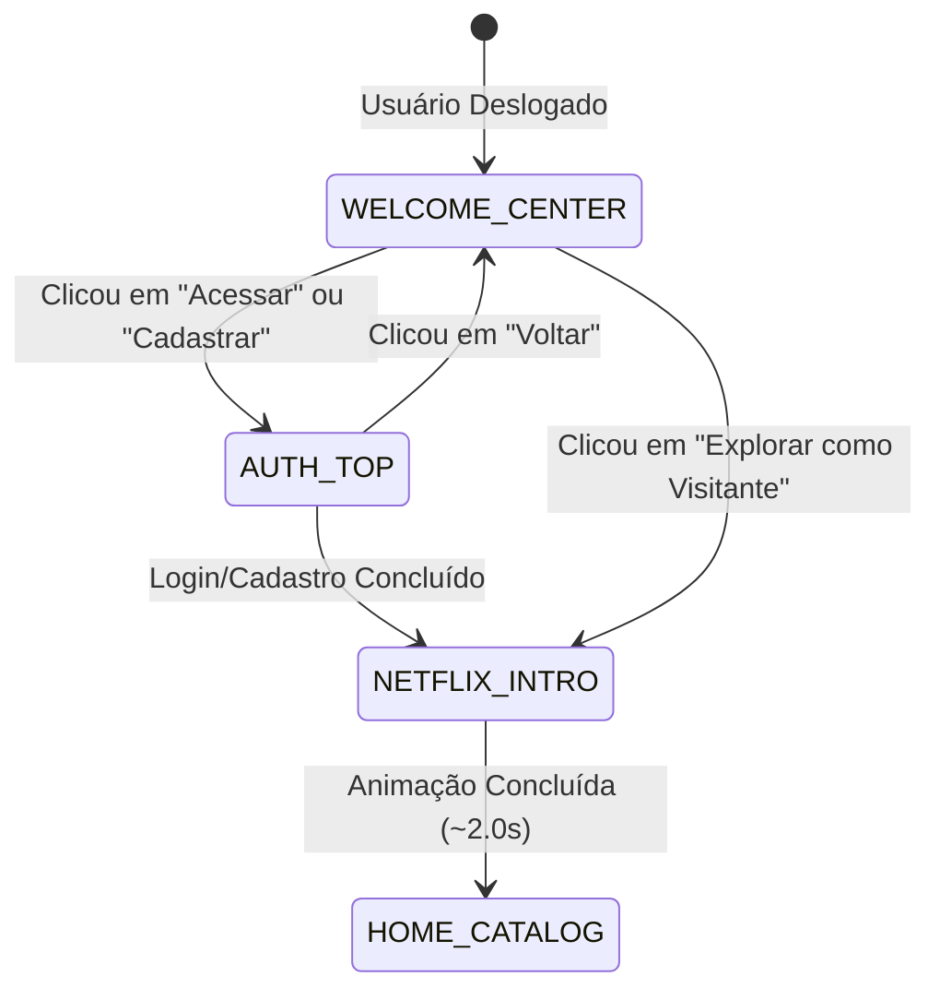

# 📋 SOP-010: Welcome Screen Cinematográfica, Animação do Logo e Transição Estilo Netflix

> **Status:** Aprovado e em Execução  
> **Versão:** 1.0.0  
> **Data:** 2026-09-22  
> **Autor:** Antigravity v2.5.5 (Gemini 3.8 Flash Edition)

---

## 🎯 1. Objetivo

1. **Correção Definitiva do Carregamento da Welcome Screen:**
   - Garantir que a Welcome Screen seja renderizada com fundo escuro cinematográfico fixo (`#0D0D0E` / `#141414`), eliminando o flash de tela branca ou sobreposição indevida do Header de navegação.
   - Ocultar totalmente o `Header`, `BottomNav` e `Footer` enquanto o visitante estiver na Welcome Screen ou no fluxo de autenticação.
2. **Logotipo Dinâmico com Movimento de Estados:**
   - **Estado Inicial (Welcome):** Logotipo ComixFlix com monograma CF em proporção **GRANDE NO CENTRO** da tela, com glow neon e os botões "Cadastrar conta" e "Acessar conta".
   - **Ao Clicar para Logar ou Cadastrar:** Animação fluida em CSS onde o logotipo **diminui e sobe para o topo**, revelando suavemente o painel de autenticação centralizado abaixo dele.
3. **Efeito de Abertura Estilo Netflix ("CF" do ComixFlix):**
   - Disparado imediatamente após a conclusão do login, cadastro ou ao optar por explorar como visitante.
   - O logotipo volta a ficar **GRANDE NO CENTRO**, sofrendo zoom dramático e explosão de feixes luminosos vermelhos (efeito *N* da Netflix).
   - Duração precisa de **1.8 a 2.0 segundos**, revelando a tela principal do catálogo por trás de forma cinematográfica.
4. **Efeito Sonoro Nativo via Web Audio API:**
   - Síntese suave e autossuficiente via `AudioContext` no navegador: impacto grave estilo *whoosh* cinematográfico somado ao efeito sutil de virada rápida de páginas de revista em quadrinhos.

---

## 🏗️ 2. Máquina de Estados da Welcome Screen

---

## 🔊 3. Arquitetura do Efeito Sonoro (Web Audio API)

Não utiliza arquivos de áudio externos para evitar latência, erros de CORS ou falhas de download. O som é sintetizado nativamente:
1. **OscillatorNode (Sub-bass):** Onda senoidal descendo de 110Hz para 35Hz com decay exponencial suave (impacto cinema).
2. **Bandpass Noise Buffer (Páginas de HQ):** Rajada curta de ruído branco filtrado entre 800Hz e 4000Hz simulando o folhear ágil de páginas de papel de quadrinho físico.
