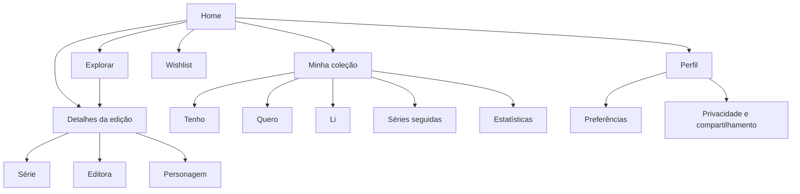

# ComixFlix — Design Definitivo de UI/UX e Guia de Implementação

## 1. Visão do produto

### 1.1 Perfil

- **Nome:** ComixFlix.
- **Tipo:** Plataforma web/PWA mobile-first para descoberta, organização e acompanhamento de coleções de quadrinhos físicos.
- **Conceito:** Experiência de descoberta de streaming aplicada a quadrinhos colecionáveis.
- **Público:** Leitores, colecionadores e fãs de quadrinhos, inicialmente com foco no catálogo brasileiro.
- **Tema padrão:** Dark mode, com light mode opcional.
- **Plataformas:** Web responsiva, smartphone, tablet e desktop.
- **Idioma inicial:** Português do Brasil.

### 1.2 Problema

As informações de lançamentos, preços, capas, séries, edições possuídas e itens desejados ficam dispersas entre lojas, editoras, planilhas e memória pessoal. O ComixFlix deve transformar esses dados em uma biblioteca visual, pesquisável e acionável.

### 1.3 Proposta de valor

Permitir que o usuário descubra quadrinhos, consulte informações, marque o que deseja comprar, registre o que possui, acompanhe leituras e identifique lacunas em séries com poucos cliques.

### 1.4 Perfis

- Visitante.
- Usuário autenticado.
- Colecionador iniciante.
- Colecionador recorrente.
- Leitor.
- Usuário social opcional.
- Operador de catálogo em área restrita futura.

### 1.5 Indicadores

- Tempo para encontrar uma edição.
- Taxa de conclusão de Quero, Tenho e Li.
- Tempo até a primeira edição cadastrada.
- Uso de busca e filtros.
- Séries seguidas por usuário.
- Retorno após alertas.
- Erros de interação.
- Performance e acessibilidade.

## 2. Premissas e decisões de design

### Requisitos confirmados

- Interface mobile-first e responsiva.
- Capas são o principal elemento visual.
- Dark mode padrão e light mode opcional.
- Referências: Netflix, Comixology e Letterboxd.
- Ações rápidas: Mais detalhes, Quero, Tenho e Li.
- Cadastro por cliques, com formulários complementares opcionais.
- Catálogo inicial de Panini, Mythos e Pipoca & Nanquim.
- Áreas principais: Home, Explorar, Coleção, Wishlist e Perfil.

### Decisões

- Mobile: toque revela ações e detalhes abrem em drawer.
- Desktop: hover é complementar, nunca obrigatório.
- Tenho e Li são estados independentes.
- Quero pode coexistir com Tenho até ser removido.
- Detalhes possuem página própria e apresentação contextual em modal/drawer.
- Mobile usa barra inferior; desktop usa navegação superior.
- Busca aceita título, série, editora, personagem e ISBN.
- Campos ausentes exibem “Não informado”.
- Dados reais, endpoints e credenciais são externos ao documento e vêm do ambiente.

### Funcionalidades futuras

Leitor digital, marketplace, valuation de mercado, rede social completa, OCR avançado e painel operacional completo não devem dominar o MVP visual.

## 3. Estratégia de UX

### Princípios

1. Capa primeiro, contexto sempre.
2. Ação frequente em um toque.
3. Descoberta sem perder controle.
4. Status claros e reversíveis.
5. Feedback imediato.
6. Densidade adaptada ao dispositivo.
7. Acessibilidade independente de cor, hover e animação.
8. Dados incompletos apresentados com transparência.

### Jornada principal

Home → lançamento/promoção → busca/filtro → card → detalhes → Quero/Tenho/Li → Coleção/Wishlist.

### Riscos

| Risco | Solução |
|---|---|
| Confusão entre status | Ícone, texto, cor, tooltip e label |
| Excesso de carrosséis | Limitar rows e oferecer Ver todos |
| Ação acidental | Toast, desfazer e confirmação quando necessário |
| Dados ausentes | Estado explícito |
| Filtro preso | Chips ativos e Limpar filtros |
| Dependência de hover | Toque, clique e teclado |

## 4. Arquitetura de informação



### Rotas

- `/` — Home.
- `/explorar` — Busca, filtros e catálogo.
- `/edicoes/[id]` — Detalhes.
- `/series/[id]` — Série e completude.
- `/editoras/[slug]` — Editora.
- `/personagens/[slug]` — Personagem.
- `/colecao` — Dashboard.
- `/colecao/tenho` — Estante.
- `/colecao/quero` — Wishlist.
- `/colecao/li` — Leituras.
- `/colecao/series` — Séries seguidas.
- `/colecao/estatisticas` — Estatísticas.
- `/perfil` — Preferências.
- `/u/[username]` — Perfil público opcional.

### Busca e filtros

Filtros: editora, série, personagem, data, preço, disponibilidade, formato e status pessoal.

Ordenação: relevância, recentes, antigos, menor preço, maior preço e título A–Z.

Mobile utiliza bottom sheet. Desktop utiliza painel lateral ou barra expandida.

## 5. Fluxos de usuário

### Explorar e abrir detalhes

Card → Mais detalhes → drawer mobile/modal ou página desktop → consultar ficha → abrir relacionados/site externo.

### Marcar Quero

Coração → estado ativo → toast → opção Desfazer.

### Marcar Tenho

Estante → cadastro rápido → dados opcionais de condição, preço e data → coleção e estatísticas atualizadas.

### Marcar Li

Livro → estado lido → nota opcional de 1 a 5 → histórico atualizado.

### Seguir série

Série → Seguir → notificações → pull list e lacunas.

### Autenticação contextual

Ação pessoal sem sessão → login → retorno à edição e conclusão da ação original.

### Compartilhar

Perfil → ativar público → revisar dados → copiar link.

## 6. Direção visual

### Conceito

Streaming visual para colecionadores: interface cinematográfica, escura e imersiva, com capas em destaque, rows horizontais e superfícies que favorecem leitura.

### Personalidade

Moderna, cultural, colecionável, organizada, entusiasta e premium sem ser elitista.

### Referências

- Netflix: hero, rows e descoberta.
- Comixology: capas, séries e ficha técnica.
- Letterboxd: status, notas, listas e perfil.
- Material Design 3: comportamento e acessibilidade.

### Evitar

Neon excessivo, fundos poluídos, textos longos em cards pequenos, ícones críticos sem label, carrosséis sem posição e cópia visual literal de marcas.

## 7. Design system

### 7.1 Temas

- Dark: `#141414`, `#1F1F1F`, `#2B2B2B`.
- Light: `#FFFFFF`, `#F5F5F5`, `#FFFFFF`.
- Preferência do sistema na primeira visita; escolha persistida depois.
- Imagens não são invertidas.
- Gráficos não dependem somente de cor.

### 7.2 Tokens de cor

| Token | Dark | Light | Uso |
|---|---:|---:|---|
| `color.brand.primary` | `#E50914` | `#B20710` | Marca e CTA |
| `color.brand.primary-hover` | `#F40612` | `#E50914` | Hover |
| `color.brand.primary-active` | `#B20710` | `#8F050C` | Pressionado |
| `color.status.success` | `#46D369` | `#16803A` | Sucesso e lido |
| `color.status.warning` | `#FFB400` | `#9A6500` | Promoção |
| `color.status.error` | `#FF5A63` | `#B4232A` | Erro |
| `color.status.info` | `#4DA3FF` | `#0066CC` | Informação |
| `color.status.wishlist` | `#E50914` | `#B20710` | Quero |
| `color.status.collection` | `#4DA3FF` | `#0066CC` | Tenho |
| `color.bg.canvas` | `#141414` | `#FFFFFF` | Fundo |
| `color.bg.surface` | `#1F1F1F` | `#F5F5F5` | Cards |
| `color.bg.elevated` | `#2B2B2B` | `#FFFFFF` | Modais |
| `color.border.default` | `#404040` | `#E5E5E5` | Bordas |
| `color.text.primary` | `#FFFFFF` | `#141414` | Texto principal |
| `color.text.secondary` | `#B3B3B3` | `#4D4D4D` | Texto secundário |
| `color.text.tertiary` | `#8C8C8C` | `#6B6B6B` | Metadados |
| `color.promo` | `#FFB400` | `#9A6500` | Promoção |

Texto de corpo: contraste mínimo de 4,5:1. Ícones e controles: 3:1.

### 7.3 Tipografia

Principal: Inter; fallback `-apple-system`, BlinkMacSystemFont, Segoe UI, sans-serif. Display opcional apenas no hero.

| Estilo | Mobile | Desktop | Peso | Uso |
|---|---:|---:|---:|---|
| Display | 36px | 64px | 700 | Hero |
| H1 | 32px | 48px | 700 | Página |
| H2 | 24px | 32px | 700 | Seção |
| H3 | 20px | 24px | 600 | Card |
| Corpo grande | 16px | 18px | 400 | Sinopse |
| Corpo | 14px | 16px | 400 | Conteúdo |
| Label | 14px | 14px | 600 | Controles |
| Caption | 12px | 12px | 500 | Metadados |
| Preço | 18px | 22px | 700 | Preço |

Line-height: títulos 1,2; corpo 1,5; texto longo 1,625.

### 7.4 Espaçamento

Escala 4px: `0, 4, 8, 12, 16, 20, 24, 32, 40, 48, 64, 80, 96px`.

Área mínima de toque 44 × 44px. Padding mobile 16px; desktop 24–40px. Gap de cards 12px mobile e 16px desktop.

### 7.5 Grid e breakpoints

- `xs`: 320px.
- `sm`: 640px.
- `md`: 768px.
- `lg`: 1024px.
- `xl`: 1280px.
- `2xl`: 1536px.

Container máximo 1440px. Explorar usa 2 colunas em telas pequenas, 3 em smartphones maiores, 4 em tablets e 5–7 em desktops.

### 7.6 Raios e elevação

`sm` 4px, `md` 8px, `lg` 12px, `xl` 16px, `full` 9999px. Usar sombras discretas e priorizar contraste entre superfícies.

### 7.7 Ícones

Lucide ou equivalente, estilo linear, traço 2px. Tamanhos de 16, 20, 24 e 32px conforme contexto. Ações críticas têm texto ou tooltip.

## 8. Componentes

### 8.1 Logo

Wordmark ComixFlix com referência sutil a painel ou balão. Versões horizontal e compacta. Não copiar elementos proprietários.

### 8.2 Header

**Mobile:** logo, busca, tema e perfil/menu.

**Desktop:** logo, Home, Explorar, Coleção, busca, tema, notificações e perfil.

Estados: normal, sobre hero, rolado, menu aberto e deslogado.

### 8.3 BottomNav

Mobile fixa acima da safe area com Home, Explorar, Coleção, Wishlist e Perfil. Ícone, label e estado ativo.

### 8.4 ComicCard

Capa 2:3, título até duas linhas, editora/série, preço, badge e overlay com detalhes, Quero, Tenho e Li. Ações acessíveis por toque, clique e teclado.

Estados: default, hover, foco, pressed, selecionado, loading, sem imagem, erro de imagem e indisponível.

### 8.5 HeroCarousel

3–7 destaques, 60vh no mobile, 560–680px no desktop, imagem full-bleed, gradiente, título, badge, preço, CTA, ações rápidas e dots. Autoplay pausável ou desativado por padrão.

### 8.6 ContentRow

Título, contador opcional, Ver todos, scroll horizontal com snap e parte do card seguinte visível.

### 8.7 ComicDetailsDrawer/Modal

Mobile bottom sheet; desktop modal até 720px ou página. Contém capa, metadados, preços, sinopse, personagens, autores, ficha técnica, status, ações e relacionados. Fechamento por botão, backdrop e Escape; foco retorna à origem.

### 8.8 Filtros

Chips ativos, bottom sheet mobile ou painel desktop, aplicar, limpar e contador.

### 8.9 Badges

Quero: vermelho; Tenho: azul; Li: verde; Promoção: amarelo; Pré-venda: calendário; Esgotado: estado neutro legível.

### 8.10 Toasts

Ícone, mensagem, duração suficiente para leitura e Desfazer quando possível.

### 8.11 Cards de estatística

Número, label e contexto. Grid de duas colunas mobile e quatro desktop. Nunca depender somente de cor.

### 8.12 Formulários

Ações rápidas não exigem preenchimento. Complementos: condição, preço, data, local, tags e nota. Labels persistentes e erros associados.

## 9. Estados da interface

### Home

- Loading: skeleton de hero, títulos e cards.
- Vazia: destaque informativo e link para Explorar.
- Erro: banner e tentar novamente.
- Offline: aviso de dados desatualizados.

### Explorar

- Sem busca: destaques e lançamentos.
- Sem resultados: mensagem e limpar filtros.
- Conteúdo parcial: indicar campos incompletos.
- Loading adicional: skeleton ao final.

### Coleção

- Primeiro acesso: adicionar primeira edição.
- Preenchida: estatísticas e recentes.
- Sem lacunas: mensagem de conquista.
- Sem séries: incentivo para seguir.

### Integrações

Cada integração pode estar em `não configurada`, `carregando`, `disponível`, `indisponível`, `erro`, `offline` ou `sem permissão`. O estado sempre apresenta mensagem e ação de recuperação quando possível.

## 10. Telas e páginas

### Home — `/`

Header → Hero → lançamentos → promoções → suas séries → populares → lacunas → navegação.

### Explorar — `/explorar`

Título → busca → filtros → ordenação → contador → grid → paginação.

### Detalhes — `/edicoes/[id]`

Capa → título → editora/data → preços → disponibilidade → status → sinopse → personagens → autores → ficha → link externo → relacionados.

### Série — `/series/[id]`

Capa, descrição, editora, status, seguir, completude, próximas, possuídas, faltantes e grid.

### Coleção — `/colecao`

Tabs, estatísticas, recentes, lacunas, promoções e grid filtrável.

### Wishlist — `/colecao/quero`

Itens, prioridade, preços atual/alvo, promoções, links e remoção.

### Lidos — `/colecao/li`

Histórico, notas, datas e ordenação.

### Séries seguidas — `/colecao/series`

Cards, próximo lançamento, possuídas, faltantes, completude e notificações.

### Estatísticas — `/colecao/estatisticas`

Edições por editora, personagens, aquisições, leituras, completude e valor. Gráficos têm resumo textual.

### Perfil — `/perfil`

Identidade, resumo, tema, notificações, perfil público, compartilhamento, exportação, conta e logout.

## 11. Responsividade

### Mobile

BottomNav fixa, cards em grid ou rows horizontais, filtros em bottom sheet, detalhes em drawer, toque de 44px e safe area.

### Tablet

Grid de quatro colunas, estatísticas em duas colunas e modal lateral/central.

### Desktop

Navegação superior, grid de 5–7 colunas, filtros laterais, modal/página detalhada e hover complementar.

Nunca ocultar título, abrir detalhes, status, preço/promoção, fechar overlay ou erro/confirmação.

## 12. Acessibilidade

- HTML semântico e headings corretos.
- Teclado em todos os controles.
- Foco visível de 2px ou mais.
- `aria-label` em botões de ícone.
- Cards com nome acessível.
- Modais com foco controlado e retorno à origem.
- Toast com `aria-live`.
- Não depender apenas de cor.
- Alt text para capas.
- `prefers-reduced-motion`.
- Alternativa textual para gráficos.
- Labels persistentes.
- Zoom de 200% sem perda de ações.

## 13. HTML semântico e convenções

```html
<body>
  <header id="site-header"></header>
  <nav id="primary-navigation" aria-label="Navegação principal"></nav>
  <main id="main-content"></main>
  <footer id="site-footer"></footer>
</body>
```

IDs: `#site-header`, `#global-search`, `#primary-navigation`, `#bottom-navigation`, `#main-content`, `#hero-featured`, `#catalog-filters`, `#comic-results`, `#comic-details`, `#collection-dashboard`, `#wishlist-list`, `#series-list`, `#profile-settings` e `#toast-region`.

Classes: `.comic-card`, `.comic-card__cover`, `.comic-card__actions`, `.status-badge`, `.content-row`, `.filter-chip` e `.empty-state`.

## 14. Motion design e microinterações

| Interação | Trigger | Animação | Duração | Easing | Reduced motion |
|---|---|---|---:|---|---|
| Card | Hover | Escala 1 → 1,03 | 200ms | ease-out | Remover escala |
| Ações do card | Foco/toque | Fade + slide 12px | 150ms | ease-out | Apenas fade |
| Coração | Toque | Escala 1 → 1,2 → 1 e preenchimento | 220ms | spring suave | Mudança instantânea |
| Estante | Toque | Bounce de encaixe e badge | 300ms | spring | Badge sem bounce |
| Drawer | Abrir/fechar | Slide vertical | 300ms | spring | Fade simples |
| Toast | Entrada | Fade + deslocamento | 200ms | ease-out | Fade curto |
| Skeleton | Loading | Brilho/opacidade | 1,2s loop | linear | Opacidade estática |
| Hero | Troca | Fade + slide de conteúdo | 300ms | ease-in-out | Troca sem movimento |
| Pull-to-refresh | Arrastar | Spinner e atualização | variável | linear | Spinner simples |

Autoplay deve ser pausável; nunca usar animação como única indicação de estado.

## 15. Wireframes textuais

### 15.1 Home

```text
┌─────────────────────────────────────┐
│ [Logo]        [Busca] [Tema] [Perfil]│
├─────────────────────────────────────┤
│                                     │
│          [ HERO / DESTAQUE ]        │
│       Capa + título + preço         │
│      [Ver detalhes] [♥] [Estante]  │
│               • ○ ○                 │
├─────────────────────────────────────┤
│ Lançamentos da semana     Ver todos │
│ [Card] [Card] [Card] [Card] →       │
├─────────────────────────────────────┤
│ Promoções ativas          Ver todos │
│ [Card] [Card] [Card] [Card] →       │
├─────────────────────────────────────┤
│ Baseado nas suas séries             │
│ [Card] [Card] [Card] [Card] →       │
├─────────────────────────────────────┤
│ [Home] [Explorar] [Coleção] [♥] [Perfil]│
└─────────────────────────────────────┘
```

### 15.2 Explorar

```text
┌─────────────────────────────────────┐
│ [←] Explorar              [Tema]    │
├─────────────────────────────────────┤
│ [ 🔍 Buscar título, série, ISBN ]   │
│ [Editora] [Personagem] [Preço]      │
│ [Filtros ativos ×]       [Limpar]   │
├─────────────────────────────────────┤
│ 248 edições       Ordenar: Relevância│
├─────────────────────────────────────┤
│ [Card] [Card] [Card]                │
│ [Card] [Card] [Card]                │
│ [Card] [Card] [Card]                │
│             [Carregar mais]         │
├─────────────────────────────────────┤
│ [Home] [Explorar] [Coleção] [♥] [Perfil]│
└─────────────────────────────────────┘
```

### 15.3 Detalhes da edição

```text
┌─────────────────────────────────────┐
│ [←] Detalhes                 [⋮]    │
├─────────────────────────────────────┤
│           [CAPA DA EDIÇÃO]          │
├─────────────────────────────────────┤
│ Batman #1                           │
│ Panini · março de 2026              │
│ R$ 24,90   R$ 29,90  [Promoção]     │
│                                     │
│ [♥ Quero] [▣ Tenho] [▤ Li]          │
│                                     │
│ Sinopse                              │
│ Texto da descrição da edição...     │
│                                     │
│ Personagens: [Batman] [Robin]      │
│ Autores: ...                        │
│ Páginas: 32 · Formato: Físico       │
│                                     │
│ [Ver na editora ↗]                  │
│ Edições relacionadas                │
│ [Card] [Card] [Card] →              │
└─────────────────────────────────────┘
```

### 15.4 Minha Coleção

```text
┌─────────────────────────────────────┐
│ Minha coleção             [Busca]   │
├─────────────────────────────────────┤
│ [Tenho] [Quero] [Li] [Séries]      │
│ ┌────────┐ ┌────────┐ ┌──────────┐ │
│ │ 523    │ │ 47     │ │ 89%      │ │
│ │Edições │ │Séries  │ │Completude│ │
│ └────────┘ └────────┘ └──────────┘ │
│ Adicionados recentemente            │
│ [Card] [Card] [Card] →              │
│ Faltando nas suas séries            │
│ [Card] [Card] [Card] →              │
│ [Grid de coleção]                   │
└─────────────────────────────────────┘
```

### 15.5 Wishlist

```text
┌─────────────────────────────────────┐
│ Wishlist                  [Filtros] │
├─────────────────────────────────────┤
│ 32 itens · 5 em promoção            │
│ [Alta] [Média] [Baixa] [Editora]    │
├─────────────────────────────────────┤
│ [Capa] Batman #1       R$ 24,90 ♥   │
│        [Promoção] [Ver na editora] │
│ [Capa] Sandman         R$ 49,90 ♥   │
│        Preço-alvo: R$ 39,90        │
├─────────────────────────────────────┤
│ [Home] [Explorar] [Coleção] [♥] [Perfil]│
└─────────────────────────────────────┘
```

### 15.6 Séries seguidas

```text
┌─────────────────────────────────────┐
│ Séries seguidas          [Ordenar]  │
├─────────────────────────────────────┤
│ Batman                                  │
│ [Capa] 47/52 edições · 90%          │
│ Próxima: edição #53 · [Notificações]│
│ Faltam: #12, #27, #44               │
├─────────────────────────────────────┤
│ Homem-Aranha                          │
│ [Capa] 18/24 edições · 75%          │
│ Próxima: pré-venda                   │
└─────────────────────────────────────┘
```

### 15.7 Perfil

```text
┌─────────────────────────────────────┐
│ Perfil                    [Config.] │
├─────────────────────────────────────┤
│          [Avatar]                   │
│          Nome do usuário             │
│          523 edições · 47 séries    │
├─────────────────────────────────────┤
│ [Editar perfil] [Compartilhar]      │
│ Tema                         [Dark]  │
│ Notificações                 [On]   │
│ Perfil público               [Off]  │
│ Exportar coleção                    │
│ Conta e privacidade                │
│ Sair                                │
└─────────────────────────────────────┘
```

## 16. Conteúdo e linguagem

Tom entusiasta, claro, direto e acolhedor. Labels: Ver detalhes, Quero, Tenho, Li, Seguir série, Ver todos, Aplicar filtros, Limpar filtros, Ver na editora, Adicionar à coleção e Remover da wishlist.

Estados vazios:

- “Sua estante ainda está vazia.”
- “Comece explorando os lançamentos.”
- “Nenhuma edição encontrada com esses filtros.”
- “Você ainda não segue nenhuma série.”
- “Não há edições faltantes nesta série.”

Moeda em Real brasileiro, datas localizadas e pluralização correta.

## 17. Dados, validação e formulários

Ações rápidas não exigem formulário. Complementos: condição, preço pago, data, local, tags e nota.

Validar preço positivo, nota inteira de 1 a 5, data válida e tags limitadas. Confirmar remoções permanentes.

## 18. Imagens e mídia

- Capas em proporção 2:3.
- Hero com `object-fit: cover`.
- Lazy loading abaixo da dobra.
- Primeira imagem com prioridade quando necessário.
- Placeholder para capa ausente.
- `srcset` e formatos modernos.
- Alt text: “Capa de [título], [série], edição [número]”.
- Fallback para imagem quebrada.

## 19. Performance percebida

Skeleton preserva dimensões. Usar lazy loading, paginação, cache, atualização otimista segura, preservação de scroll, aviso de rede lenta e estados offline. Não bloquear a interface enquanto notificações são processadas.

## 20. Segurança e confiança

- Indicar saída para sites externos.
- Opt-in para perfil público.
- Valor da coleção privado por padrão.
- Confirmar exclusões.
- Informar sincronização pendente.
- Não exibir credenciais no cliente.
- Estados de integração não configurada, indisponível, erro e offline devem ser compreensíveis.

## 21. Internacionalização

Suportar expansão de textos de 30%, datas, moedas, números, pluralização, nomes longos e traduções futuras. Evitar larguras fixas.

## 22. Integrações e configurações externas

- APIs, MCPs, Google Stitch, feature flags, temas e endpoints devem usar variáveis de ambiente.
- Segredos nunca aparecem no código front-end, protótipo ou design.
- Criar `.env-example` na raiz com todas as variáveis necessárias e placeholders seguros.
- Variáveis públicas só usam `NEXT_PUBLIC_` quando a exposição for segura.
- A interface deve tratar integração não configurada, carregando, disponível, indisponível, erro, offline e sem permissão.
- Documentar cada variável: nome, finalidade, obrigatoriedade, ambiente e origem.
- Feature flags não podem quebrar a navegação quando uma funcionalidade estiver desativada.

## 23. Código de referência e guia de implementação

Os códigos abaixo são referências completas de comportamento e estilo. Devem ser adaptados às APIs reais do projeto, manter acessibilidade e nunca conter segredos.

### 23.1 Estrutura de diretórios

```text
components/
├── ui/
│   ├── Button.tsx
│   ├── Dialog.tsx
│   ├── Drawer.tsx
│   ├── Toast.tsx
│   └── Skeleton.tsx
├── comic/
│   ├── ComicCard.tsx
│   ├── ComicDetailsDrawer.tsx
│   ├── ContentRow.tsx
│   └── HeroCarousel.tsx
├── layout/
│   ├── Header.tsx
│   ├── BottomNav.tsx
│   └── ThemeToggle.tsx
└── stats/
    └── StatCard.tsx
```

### 23.2 Modelo compartilhado

```tsx
// types/comic.ts
export type ComicStatus = 'quero' | 'tenho' | 'li' | 'lendo';

export interface Comic {
  id: string;
  titulo: string;
  url_capa: string;
  editora: string;
  serie?: string | null;
  personagem_principal?: string | null;
  preco_normal?: number | null;
  preco_promocional?: number | null;
  data_lancamento?: string | null;
  resumo_sinopse?: string | null;
  url_produto?: string | null;
  autores?: string[];
  paginas?: number | null;
  formato?: string | null;
}
```

### 23.3 ComicCard

```tsx
'use client';

import { useState } from 'react';
import { AnimatePresence, motion } from 'framer-motion';
import { BookOpen, Heart, Library, Plus } from 'lucide-react';
import type { Comic, ComicStatus } from '@/types/comic';

interface ComicCardProps {
  comic: Comic;
  userStatus?: ComicStatus;
  onDetails?: (comic: Comic) => void;
  onAction?: (comicId: string, action: ComicStatus) => void;
}

const statusLabel: Record<ComicStatus, string> = {
  quero: 'Quero',
  tenho: 'Tenho',
  li: 'Li',
  lendo: 'Lendo',
};

export function ComicCard({ comic, userStatus, onDetails, onAction }: ComicCardProps) {
  const [showActions, setShowActions] = useState(false);
  const [status, setStatus] = useState(userStatus);

  function handleAction(action: ComicStatus) {
    setStatus(action);
    onAction?.(comic.id, action);
  }

  const currentPrice = comic.preco_promocional ?? comic.preco_normal;
  const hasPromotion = Boolean(
    comic.preco_promocional &&
    comic.preco_normal &&
    comic.preco_promocional < comic.preco_normal,
  );

  return (
    <motion.article
      className="group relative w-[140px] overflow-hidden rounded-md bg-surface md:w-[200px]"
      onMouseEnter={() => setShowActions(true)}
      onMouseLeave={() => setShowActions(false)}
      whileHover={{ scale: 1.03 }}
      transition={{ duration: 0.2, ease: 'easeOut' }}
    >
      <button
        type="button"
        className="block w-full text-left focus-visible:outline focus-visible:outline-2 focus-visible:outline-offset-2 focus-visible:outline-primary"
        onClick={() => onDetails?.(comic)}
        aria-label={`Ver detalhes de ${comic.titulo}`}
        onFocus={() => setShowActions(true)}
      >
        <div className="relative aspect-[2/3] overflow-hidden">
          
          <div className="pointer-events-none absolute inset-0 bg-gradient-to-t from-black/90 via-black/20 to-transparent" />
          {status && (
            <span className="absolute left-2 top-2 rounded-sm bg-black/70 px-2 py-1 text-xs font-semibold text-white">
              {statusLabel[status]}
            </span>
          )}
          <div className="absolute inset-x-0 bottom-0 p-3 text-white">
            <h3 className="line-clamp-2 text-sm font-bold leading-tight">{comic.titulo}</h3>
            <div className="mt-1 flex items-center gap-2 text-sm">
              {currentPrice != null && (
                <span className={hasPromotion ? 'font-bold text-green-300' : 'text-white'}>
                  R$ {currentPrice.toFixed(2).replace('.', ',')}
                </span>
              )}
              {hasPromotion && (
                <span className="text-xs text-gray-300 line-through">
                  R$ {comic.preco_normal!.toFixed(2).replace('.', ',')}
                </span>
              )}
            </div>
          </div>
        </div>
      </button>

      <AnimatePresence>
        {showActions && (
          <motion.div
            initial={{ opacity: 0, y: 12 }}
            animate={{ opacity: 1, y: 0 }}
            exit={{ opacity: 0, y: 12 }}
            className="absolute right-2 top-2 z-10 flex flex-col gap-2"
            aria-label="Ações da edição"
          >
            <ActionButton
              label="Quero"
              active={status === 'quero'}
              onClick={() => handleAction('quero')}
            >
              <Heart size={18} fill={status === 'quero' ? 'currentColor' : 'none'} />
            </ActionButton>
            <ActionButton label="Tenho" active={status === 'tenho'} onClick={() => handleAction('tenho')}>
              <Library size={18} />
            </ActionButton>
            <ActionButton label="Li" active={status === 'li'} onClick={() => handleAction('li')}>
              <BookOpen size={18} />
            </ActionButton>
            <ActionButton label="Mais detalhes" onClick={() => onDetails?.(comic)}>
              <Plus size={18} />
            </ActionButton>
          </motion.div>
        )}
      </AnimatePresence>
    </motion.article>
  );
}

function ActionButton({
  label,
  active,
  onClick,
  children,
}: {
  label: string;
  active?: boolean;
  onClick: () => void;
  children: React.ReactNode;
}) {
  return (
    <button
      type="button"
      aria-label={label}
      title={label}
      onClick={(event) => {
        event.stopPropagation();
        onClick();
      }}
      className={`flex h-10 w-10 items-center justify-center rounded-full backdrop-blur-sm transition-colors focus-visible:outline focus-visible:outline-2 focus-visible:outline-white ${
        active ? 'bg-primary text-white' : 'bg-black/70 text-white hover:bg-black'
      }`}
    >
      {children}
    </button>
  );
}
```

### 23.4 HeroCarousel

```tsx
'use client';

import { useRef, useState } from 'react';
import { motion } from 'framer-motion';
import { ChevronLeft, ChevronRight, Heart, Library, BookOpen } from 'lucide-react';
import type { Comic, ComicStatus } from '@/types/comic';

export function HeroCarousel({
  comics,
  onDetails,
  onAction,
}: {
  comics: Comic[];
  onDetails?: (comic: Comic) => void;
  onAction?: (comicId: string, action: ComicStatus) => void;
}) {
  const scrollRef = useRef<HTMLDivElement>(null);
  const [currentIndex, setCurrentIndex] = useState(0);

  function goTo(index: number) {
    const container = scrollRef.current;
    if (!container) return;
    const next = Math.max(0, Math.min(index, comics.length - 1));
    container.scrollTo({ left: next * container.clientWidth, behavior: 'smooth' });
    setCurrentIndex(next);
  }

  if (!comics.length) return null;

  return (
    <section aria-label="Edições em destaque" className="relative h-[60vh] min-h-[440px] overflow-hidden">
      <div
        ref={scrollRef}
        className="flex h-full snap-x snap-mandatory overflow-x-auto scrollbar-hide"
        onScroll={(event) => {
          const element = event.currentTarget;
          setCurrentIndex(Math.round(element.scrollLeft / element.clientWidth));
        }}
      >
        {comics.map((comic) => (
          <article key={comic.id} className="relative h-full w-full shrink-0 snap-center">
            
            <div className="absolute inset-0 bg-gradient-to-t from-black/95 via-black/45 to-transparent" />
            <div className="absolute inset-x-0 bottom-0 p-6 md:p-12">
              <motion.div initial={{ opacity: 0, y: 20 }} animate={{ opacity: 1, y: 0 }} className="max-w-2xl">
                <span className="mb-3 inline-block rounded-full bg-secondary px-3 py-1 text-sm font-semibold text-black">
                  Nova edição
                </span>
                <h1 className="text-3xl font-bold text-white md:text-5xl">{comic.titulo}</h1>
                {comic.personagem_principal && <p className="mt-2 text-lg text-gray-200">{comic.personagem_principal}</p>}
                <div className="mt-5 flex flex-wrap items-center gap-3">
                  <button
                    type="button"
                    onClick={() => onDetails?.(comic)}
                    className="rounded-md bg-white px-6 py-3 font-semibold text-black hover:bg-gray-200 focus-visible:outline focus-visible:outline-2 focus-visible:outline-white"
                  >
                    Ver detalhes
                  </button>
                  <QuickAction label="Quero" onClick={() => onAction?.(comic.id, 'quero')}><Heart size={22} /></QuickAction>
                  <QuickAction label="Tenho" onClick={() => onAction?.(comic.id, 'tenho')}><Library size={22} /></QuickAction>
                  <QuickAction label="Li" onClick={() => onAction?.(comic.id, 'li')}><BookOpen size={22} /></QuickAction>
                </div>
              </motion.div>
            </div>
          </article>
        ))}
      </div>
      {comics.length > 1 && (
        <>
          <button type="button" aria-label="Destaque anterior" onClick={() => goTo(currentIndex - 1)} className="absolute left-4 top-1/2 hidden -translate-y-1/2 rounded-full bg-black/70 p-3 text-white md:block"><ChevronLeft /></button>
          <button type="button" aria-label="Próximo destaque" onClick={() => goTo(currentIndex + 1)} className="absolute right-4 top-1/2 hidden -translate-y-1/2 rounded-full bg-black/70 p-3 text-white md:block"><ChevronRight /></button>
          <div className="absolute bottom-4 left-1/2 flex -translate-x-1/2 gap-2">
            {comics.map((comic, index) => (
              <button key={comic.id} type="button" aria-label={`Ir para destaque ${index + 1}`} onClick={() => goTo(index)} className={`h-2.5 w-2.5 rounded-full ${index === currentIndex ? 'bg-white' : 'bg-white/40'}`} />
            ))}
          </div>
        </>
      )}
    </section>
  );
}

function QuickAction({ label, onClick, children }: { label: string; onClick: () => void; children: React.ReactNode }) {
  return <button type="button" aria-label={label} title={label} onClick={onClick} className="flex h-12 w-12 items-center justify-center rounded-full bg-black/65 text-white backdrop-blur-sm hover:bg-black focus-visible:outline focus-visible:outline-2 focus-visible:outline-white">{children}</button>;
}
```

### 23.5 ContentRow

```tsx
'use client';

import { useRef } from 'react';
import { ChevronRight } from 'lucide-react';
import { motion } from 'framer-motion';
import type { Comic, ComicStatus } from '@/types/comic';
import { ComicCard } from './ComicCard';

export function ContentRow({
  title,
  comics,
  onDetails,
  onAction,
  onSeeAll,
}: {
  title: string;
  comics: Comic[];
  onDetails?: (comic: Comic) => void;
  onAction?: (comicId: string, action: ComicStatus) => void;
  onSeeAll?: () => void;
}) {
  const rowRef = useRef<HTMLDivElement>(null);
  if (!comics.length) return null;

  return (
    <section aria-labelledby={`row-${title}`} className="py-8">
      <div className="mb-4 flex items-center justify-between px-4 md:px-6">
        <h2 id={`row-${title}`} className="text-xl font-semibold text-text-primary">{title}</h2>
        {onSeeAll && <button type="button" onClick={onSeeAll} className="flex items-center gap-1 text-sm text-text-secondary hover:text-text-primary">Ver todos <ChevronRight size={16} /></button>}
      </div>
      <div ref={rowRef} className="flex snap-x gap-3 overflow-x-auto px-4 scrollbar-hide md:gap-4 md:px-6">
        {comics.map((comic) => (
          <motion.div key={comic.id} className="shrink-0 snap-start" initial={{ opacity: 0, x: 20 }} whileInView={{ opacity: 1, x: 0 }} viewport={{ once: true }} transition={{ duration: 0.3 }}>
            <ComicCard comic={comic} onDetails={onDetails} onAction={onAction} />
          </motion.div>
        ))}
      </div>
    </section>
  );
}
```

### 23.6 ComicDetailsDrawer

```tsx
'use client';

import { useEffect, useRef } from 'react';
import { AnimatePresence, motion } from 'framer-motion';
import { BookOpen, ExternalLink, Heart, Library, X } from 'lucide-react';
import type { Comic, ComicStatus } from '@/types/comic';

export function ComicDetailsDrawer({
  comic,
  open,
  onClose,
  onAction,
}: {
  comic: Comic | null;
  open: boolean;
  onClose: () => void;
  onAction?: (comicId: string, action: ComicStatus) => void;
}) {
  const closeRef = useRef<HTMLButtonElement>(null);

  useEffect(() => {
    if (!open) return;
    closeRef.current?.focus();
    function onKeyDown(event: KeyboardEvent) {
      if (event.key === 'Escape') onClose();
    }
    document.addEventListener('keydown', onKeyDown);
    return () => document.removeEventListener('keydown', onKeyDown);
  }, [open, onClose]);

  return (
    <AnimatePresence>
      {open && comic && (
        <>
          <motion.div className="fixed inset-0 z-40 bg-black/80" initial={{ opacity: 0 }} animate={{ opacity: 1 }} exit={{ opacity: 0 }} onClick={onClose} />
          <motion.section role="dialog" aria-modal="true" aria-labelledby="comic-details-title" className="fixed inset-x-0 bottom-0 z-50 max-h-[90vh] overflow-y-auto rounded-t-2xl bg-surface md:left-1/2 md:top-1/2 md:max-w-3xl md:-translate-x-1/2 md:-translate-y-1/2 md:rounded-2xl" initial={{ y: '100%' }} animate={{ y: 0 }} exit={{ y: '100%' }} transition={{ type: 'spring', damping: 25, stiffness: 300 }}>
            <div className="relative aspect-[3/4] md:aspect-[16/7]">
              
              <button ref={closeRef} type="button" aria-label="Fechar detalhes" onClick={onClose} className="absolute right-4 top-4 rounded-full bg-black/70 p-2 text-white focus-visible:outline focus-visible:outline-2 focus-visible:outline-white"><X /></button>
            </div>
            <div className="space-y-6 p-6">
              <header>
                <h2 id="comic-details-title" className="text-2xl font-bold text-text-primary">{comic.titulo}</h2>
                <p className="mt-1 text-sm text-text-secondary">{comic.editora}{comic.data_lancamento ? ` · ${comic.data_lancamento}` : ''}</p>
              </header>
              <div className="flex flex-wrap items-center gap-3">
                {comic.preco_promocional != null && <strong className="text-2xl text-secondary">R$ {comic.preco_promocional.toFixed(2).replace('.', ',')}</strong>}
                {comic.preco_normal != null && <span className={comic.preco_promocional != null ? 'text-text-tertiary line-through' : 'text-2xl text-text-primary'}>R$ {comic.preco_normal.toFixed(2).replace('.', ',')}</span>}
              </div>
              <div className="grid grid-cols-3 gap-3">
                <Action label="Quero" onClick={() => onAction?.(comic.id, 'quero')}><Heart /></Action>
                <Action label="Tenho" onClick={() => onAction?.(comic.id, 'tenho')}><Library /></Action>
                <Action label="Li" onClick={() => onAction?.(comic.id, 'li')}><BookOpen /></Action>
              </div>
              {comic.resumo_sinopse && <section><h3 className="mb-2 font-semibold text-text-primary">Sinopse</h3><p className="leading-relaxed text-text-secondary">{comic.resumo_sinopse}</p></section>}
              {comic.personagem_principal && <section><h3 className="mb-2 font-semibold text-text-primary">Personagem</h3><span className="rounded-full bg-elevated px-3 py-1 text-sm text-text-primary">{comic.personagem_principal}</span></section>}
              <dl className="grid grid-cols-2 gap-3 text-sm text-text-secondary">
                {comic.autores?.length ? <><dt>Autores</dt><dd className="text-text-primary">{comic.autores.join(', ')}</dd></> : null}
                {comic.paginas ? <><dt>Páginas</dt><dd className="text-text-primary">{comic.paginas}</dd></> : null}
                {comic.formato ? <><dt>Formato</dt><dd className="text-text-primary">{comic.formato}</dd></> : null}
              </dl>
              {comic.url_produto && <a href={comic.url_produto} target="_blank" rel="noopener noreferrer" className="flex min-h-12 items-center justify-center gap-2 rounded-md bg-text-primary px-4 font-semibold text-bg-canvas hover:opacity-90">Ver na editora <ExternalLink size={16} /></a>}
            </div>
          </motion.section>
        </>
      )}
    </AnimatePresence>
  );
}

function Action({ label, onClick, children }: { label: string; onClick: () => void; children: React.ReactNode }) {
  return <button type="button" onClick={onClick} className="flex min-h-12 flex-col items-center justify-center gap-1 rounded-lg bg-elevated text-text-primary hover:bg-border-default focus-visible:outline focus-visible:outline-2 focus-visible:outline-primary"><span aria-hidden="true">{children}</span><span className="text-xs">{label}</span></button>;
}
```

### 23.7 BottomNav

```tsx
'use client';

import { motion } from 'framer-motion';
import { Heart, Home, Library, Search, User } from 'lucide-react';
import { usePathname, useRouter } from 'next/navigation';

const tabs = [
  { id: 'home', label: 'Home', icon: Home, path: '/' },
  { id: 'explorar', label: 'Explorar', icon: Search, path: '/explorar' },
  { id: 'colecao', label: 'Coleção', icon: Library, path: '/colecao' },
  { id: 'wishlist', label: 'Wishlist', icon: Heart, path: '/colecao/quero' },
  { id: 'perfil', label: 'Perfil', icon: User, path: '/perfil' },
];

export function BottomNav() {
  const pathname = usePathname();
  const router = useRouter();

  return (
    <nav id="bottom-navigation" aria-label="Navegação inferior" className="fixed inset-x-0 bottom-0 z-30 border-t border-border-default bg-surface/95 pb-safe backdrop-blur md:hidden">
      <div className="flex h-16 items-center justify-around">
        {tabs.map(({ id, label, icon: Icon, path }) => {
          const active = path === '/' ? pathname === '/' : pathname.startsWith(path);
          return <button key={id} type="button" aria-current={active ? 'page' : undefined} onClick={() => router.push(path)} className="flex h-full w-full flex-col items-center justify-center gap-1 text-xs text-text-secondary hover:text-text-primary focus-visible:outline focus-visible:outline-2 focus-visible:outline-primary"><motion.span animate={{ scale: active ? 1.1 : 1 }}><Icon size={22} fill={active && id === 'wishlist' ? 'currentColor' : 'none'} /></motion.span><span>{label}</span></button>;
        })}
      </div>
    </nav>
  );
}
```

### 23.8 ThemeToggle

```tsx
'use client';

import { Moon, Sun } from 'lucide-react';
import { motion } from 'framer-motion';
import { useEffect, useState } from 'react';

export function ThemeToggle() {
  const [dark, setDark] = useState(true);

  useEffect(() => {
    document.documentElement.classList.toggle('dark', dark);
    localStorage.setItem('comixflix-theme', dark ? 'dark' : 'light');
  }, [dark]);

  useEffect(() => {
    const stored = localStorage.getItem('comixflix-theme');
    if (stored) setDark(stored === 'dark');
  }, []);

  return <button type="button" aria-label={dark ? 'Ativar tema claro' : 'Ativar tema escuro'} onClick={() => setDark((value) => !value)} className="flex h-11 w-11 items-center justify-center rounded-full bg-elevated text-text-primary hover:bg-border-default focus-visible:outline focus-visible:outline-2 focus-visible:outline-primary"><motion.span initial={false} animate={{ rotate: dark ? 0 : 180 }}><>{dark ? <Moon size={20} /> : <Sun size={20} />}</></motion.span></button>;
}
```

## 24. Tailwind e CSS global

### 24.1 `tailwind.config.ts`

```ts
import type { Config } from 'tailwindcss';

const config: Config = {
  darkMode: 'class',
  content: ['./app/**/*.{ts,tsx}', './components/**/*.{ts,tsx}', './lib/**/*.{ts,tsx}'],
  theme: {
    extend: {
      colors: {
        primary: { DEFAULT: '#E50914', hover: '#F40612', active: '#B20710' },
        secondary: '#46D369',
        accent: '#FFB400',
        'bg-canvas': '#141414',
        surface: '#1F1F1F',
        elevated: '#2B2B2B',
        'border-default': '#404040',
        'text-primary': '#FFFFFF',
        'text-secondary': '#B3B3B3',
        'text-tertiary': '#8C8C8C',
      },
      fontFamily: { sans: ['Inter', 'system-ui', 'sans-serif'] },
      screens: { xs: '320px', sm: '640px', md: '768px', lg: '1024px', xl: '1280px', '2xl': '1536px' },
      borderRadius: { sm: '4px', md: '8px', lg: '12px', xl: '16px', '2xl': '24px' },
      boxShadow: {
        sm: '0 1px 2px rgba(0,0,0,.3)',
        md: '0 4px 8px rgba(0,0,0,.4)',
        lg: '0 8px 16px rgba(0,0,0,.5)',
        overlay: '0 0 0 1px rgba(255,255,255,.1), 0 8px 16px rgba(0,0,0,.5)',
      },
      keyframes: {
        shimmer: { '0%': { backgroundPosition: '-200% 0' }, '100%': { backgroundPosition: '200% 0' } },
      },
      animation: { shimmer: 'shimmer 1.2s linear infinite' },
    },
  },
  plugins: [],
};

export default config;
```

### 24.2 `globals.css`

```css
@tailwind base;
@tailwind components;
@tailwind utilities;

:root {
  --bg-canvas: #ffffff;
  --surface: #f5f5f5;
  --elevated: #ffffff;
  --border-default: #e5e5e5;
  --text-primary: #141414;
  --text-secondary: #4d4d4d;
  --text-tertiary: #6b6b6b;
}

.dark {
  --bg-canvas: #141414;
  --surface: #1f1f1f;
  --elevated: #2b2b2b;
  --border-default: #404040;
  --text-primary: #ffffff;
  --text-secondary: #b3b3b3;
  --text-tertiary: #8c8c8c;
}

@layer base {
  * { box-sizing: border-box; }
  html { color-scheme: dark; }
  html:not(.dark) { color-scheme: light; }
  body { margin: 0; background: var(--bg-canvas); color: var(--text-primary); font-family: Inter, system-ui, sans-serif; }
  button, a, input, select, textarea { font: inherit; }
  button { cursor: pointer; }
  :focus-visible { outline: 2px solid #4da3ff; outline-offset: 2px; }
}

@layer utilities {
  .scrollbar-hide { -ms-overflow-style: none; scrollbar-width: none; }
  .scrollbar-hide::-webkit-scrollbar { display: none; }
  .pb-safe { padding-bottom: env(safe-area-inset-bottom); }
  .pt-safe { padding-top: env(safe-area-inset-top); }
  .skeleton { background: linear-gradient(90deg, var(--surface) 25%, var(--elevated) 50%, var(--surface) 75%); background-size: 200% 100%; animation: shimmer 1.2s linear infinite; }
}

@media (prefers-reduced-motion: reduce) {
  *, *::before, *::after { animation-duration: .01ms !important; animation-iteration-count: 1 !important; scroll-behavior: auto !important; transition-duration: .01ms !important; }
}
```

## 25. Integrações e ambiente

### 25.1 Regras

- Configurações externas vêm do ambiente.
- Nunca colocar segredos em componentes, protótipos, commits ou documentação pública.
- Usar `NEXT_PUBLIC_` apenas para valores realmente públicos.
- Validar variáveis obrigatórias no startup/build.
- Criar `.env-example` na raiz.
- Documentar todas as variáveis em `documentation/operations/environment.md`.
- Feature flags devem ter fallback seguro.

### 25.2 `.env-example`

```env
# Ambiente
NODE_ENV=development
NEXT_PUBLIC_APP_NAME=ComixFlix
NEXT_PUBLIC_APP_URL=http://localhost:3000

# Firebase - valores públicos do SDK web
NEXT_PUBLIC_FIREBASE_API_KEY=
NEXT_PUBLIC_FIREBASE_AUTH_DOMAIN=
NEXT_PUBLIC_FIREBASE_PROJECT_ID=
NEXT_PUBLIC_FIREBASE_STORAGE_BUCKET=
NEXT_PUBLIC_FIREBASE_MESSAGING_SENDER_ID=
NEXT_PUBLIC_FIREBASE_APP_ID=
NEXT_PUBLIC_FIREBASE_MEASUREMENT_ID=

# Firebase Admin - somente servidor; nunca usar NEXT_PUBLIC_
FIREBASE_CLIENT_EMAIL=
FIREBASE_PRIVATE_KEY=

# Backend e funções
NEXT_PUBLIC_FUNCTIONS_REGION= southamerica-east1
FIREBASE_FUNCTIONS_BASE_URL=

# Feature flags públicas
NEXT_PUBLIC_ENABLE_LIGHT_THEME=true
NEXT_PUBLIC_ENABLE_SOCIAL_PROFILE=false
NEXT_PUBLIC_ENABLE_PRICE_ALERTS=true
NEXT_PUBLIC_ENABLE_OCR=false
NEXT_PUBLIC_ENABLE_RECOMMENDATIONS=false

# Google Stitch/MCP, quando necessário; manter segredo somente no servidor
GOOGLE_STITCH_API_KEY=
GOOGLE_STITCH_PROJECT_ID=
MCP_GOOGLE_STITCH_ENABLED=false
MCP_GITHUB_ENABLED=false
MCP_FIREBASE_ENABLED=true
MCP_SUPABASE_ENABLED=false

# GitHub, somente para automações servidoras
GITHUB_TOKEN=
GITHUB_OWNER=
GITHUB_REPOSITORY=

# Supabase, somente se o projeto utilizar esse serviço
SUPABASE_URL=
SUPABASE_ANON_KEY=
SUPABASE_SERVICE_ROLE_KEY=

# Serviços de notificações futuros
EMAIL_PROVIDER_API_KEY=
PUSH_PROVIDER_API_KEY=
```

O espaço após `FIREBASE_FUNCTIONS_BASE_URL` deve ser removido no arquivo real; o exemplo acima é ilustrativo e deve ser validado por um parser de ambiente.

### 25.3 Estados visuais

- **Não configurado:** “Esta integração ainda não foi configurada.”
- **Carregando:** skeleton/spinner com label acessível.
- **Disponível:** conteúdo normal.
- **Indisponível:** conteúdo em cache e “Tentar novamente”.
- **Erro:** mensagem específica sem detalhes sensíveis.
- **Offline:** banner não bloqueante.
- **Sem permissão:** explicar ação necessária, sem expor credenciais.

## 26. Checklist final

- [ ] Home tem hero, rows e navegação.
- [ ] Explorar tem busca, filtros, ordenação e estados vazios.
- [ ] Cards exibem capa, título, preço e ações acessíveis.
- [ ] Detalhes exibem metadados disponíveis.
- [ ] Quero, Tenho e Li têm estados e feedback.
- [ ] Série possui completude e lacunas.
- [ ] Coleção possui tabs, estatísticas e recentes.
- [ ] Wishlist possui promoção e links externos.
- [ ] Perfil possui tema, notificações e privacidade.
- [ ] Wireframes cobrem todas as telas principais.
- [ ] Componentes têm código de referência.
- [ ] Tailwind e CSS global estão definidos.
- [ ] Integrações usam ambiente e não expõem segredos.
- [ ] `.env-example` contém todas as tags necessárias.
- [ ] Estados de integração estão definidos.
- [ ] Layout funciona a partir de 320px.
- [ ] Modais controlam foco.
- [ ] Loading, vazio, erro e offline foram tratados.
- [ ] Contraste, teclado, labels e reduced motion foram tratados.
- [ ] Imagens têm lazy loading e fallback.
- [ ] Conteúdo demonstrativo é realista.
