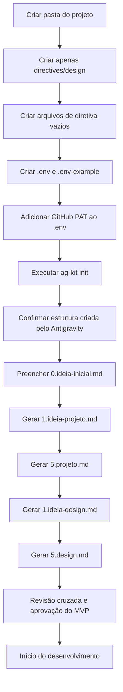

# Guia de Criação de Projetos

## Objetivo

Este guia define o processo para iniciar um novo projeto até o ponto em que o desenvolvimento pode começar. O Antigravity Kit é responsável por inicializar o repositório, a aplicação e toda a estrutura operacional e documental necessária.

Antes da implementação, a responsabilidade humana é criar a pasta inicial, preparar os arquivos de diretiva, configurar o ambiente, fornecer o token GitHub com segurança, executar o Antigravity Kit, gerar e revisar as especificações definitivas de projeto e design.

## Responsabilidades

| Responsável | Atividades |
|---|---|
| Pessoa responsável pelo projeto | Criar pasta, configurar `.env`, registrar ideia, executar prompts, revisar e aprovar escopo |
| Antigravity Kit | Inicializar Git, aplicação, estrutura de diretórios, arquivos operacionais, padrões de código e ferramentas do projeto |
| IA de especificação | Transformar as ideias e instruções em `5.projeto.md` e `5.design.md` |
| CI/CD e provedores | Armazenar secrets remotos, executar verificações e realizar deploy quando configurado |

## Princípios

- O código não começa antes das fontes de verdade serem revisadas.
- O Antigravity Kit cria a estrutura técnica; este guia não a recria manualmente.
- A documentação oficial permanece em `documentation/`.
- As diretivas de elaboração ficam em `documentation/directives/`.
- Tokens, chaves e credenciais nunca são versionados.
- O GitHub Personal Access Token é mantido exclusivamente no `.env` local ou em secrets remotos autorizados.
- O MVP é separado de evoluções e funcionalidades futuras.
- O projeto começa somente após o checkpoint de prontidão.

## Pré-requisitos

Antes de iniciar:

- Node.js LTS instalado.
- Gerenciador de pacotes disponível: `npm`, `pnpm` ou `yarn`.
- Terminal disponível.
- GitHub Personal Access Token criado com permissões mínimas necessárias.
- Acesso aos serviços externos previstos, quando aplicável.
- Antigravity Kit disponível no ambiente de desenvolvimento.
- Templates organizacionais dos prompts e instruções disponíveis.

Comandos de verificação:

```bash
node --version
npm --version
git --version
```

## Visão geral



## Etapa 1 — Criar a pasta inicial

Crie a pasta raiz do novo projeto e entre nela.

```bash
mkdir nome-do-projeto
cd nome-do-projeto
```

Regras de nomeação:

- Usar minúsculas e hífens: `comixflix`, `portal-clientes`, `gestao-estoque`.
- Evitar espaços, acentos, caracteres especiais e nomes genéricos.
- Não incluir versão no nome da pasta.

Não inicialize Git, não crie aplicação e não monte manualmente a árvore de diretórios técnica nesta etapa. Essas atividades serão realizadas pelo Antigravity Kit.

## Etapa 2 — Criar a diretiva de design

Antes de executar o Antigravity, criar somente o diretório de diretivas de design necessário para armazenar os artefatos de elaboração.

```bash
mkdir -p documentation/directives/design
```

Nenhuma outra estrutura de diretórios deve ser criada manualmente neste guia. O Antigravity Kit deverá criar, ajustar ou complementar a estrutura do projeto.

## Etapa 3 — Criar os arquivos de diretiva iniciais

Criar inicialmente os arquivos vazios que serão preenchidos e gerados durante o fluxo.

```bash
touch documentation/directives/0.ideia-inicial.md
touch documentation/directives/1.ideia-projeto.md
touch documentation/directives/5.projeto.md
touch documentation/directives/design/1.ideia-design.md
touch documentation/directives/design/5.design.md
```

Arquivos inicialmente vazios:

| Arquivo | Finalidade |
|---|---|
| `documentation/directives/0.ideia-inicial.md` | Ideia bruta, problema, público e contexto inicial |
| `documentation/directives/1.ideia-projeto.md` | Especificação inicial de produto e tecnologia |
| `documentation/directives/5.projeto.md` | Especificação técnica e funcional definitiva |
| `documentation/directives/design/1.ideia-design.md` | Ideia e requisitos iniciais de UI/UX |
| `documentation/directives/design/5.design.md` | Especificação definitiva de UI/UX e design system |

Também copiar ou criar os templates de instrução e prompts utilizados pela organização:

```bash
touch documentation/directives/0.prompt-iaexterna-inicial.md
touch documentation/directives/2.instrucao-projeto.md
touch documentation/directives/3.prompt-iaexterna-projeto.md
touch documentation/directives/4.prompt-antigravity.md
touch documentation/directives/design/2.instrucao-design.md
touch documentation/directives/design/3.prompt-iaexterna-design.md
touch documentation/directives/design/4.prompt-stitch-design.md
```

Os arquivos de instrução e prompt devem conter os modelos oficiais aprovados. Eles preservam o histórico e a lógica de geração das especificações.

## Etapa 4 — Criar e configurar o ambiente

Criar `.env` na raiz do projeto. Este arquivo é local e nunca deve ser versionado.

```bash
touch .env
```

Criar `.env-example`, que pode ser versionado e deve listar todas as variáveis exigidas sem valores sensíveis.

```bash
touch .env-example
```

Modelo inicial de `.env-example`:

```env
# Aplicação
NODE_ENV=development
NEXT_PUBLIC_APP_NAME=
NEXT_PUBLIC_APP_URL=http://localhost:3000

# GitHub: somente servidor/local, nunca NEXT_PUBLIC_
GITHUB_TOKEN=
GITHUB_OWNER=
GITHUB_REPOSITORY=

# Integrações públicas, quando aplicável
NEXT_PUBLIC_FIREBASE_API_KEY=
NEXT_PUBLIC_FIREBASE_AUTH_DOMAIN=
NEXT_PUBLIC_FIREBASE_PROJECT_ID=
NEXT_PUBLIC_FIREBASE_STORAGE_BUCKET=
NEXT_PUBLIC_FIREBASE_MESSAGING_SENDER_ID=
NEXT_PUBLIC_FIREBASE_APP_ID=

# Credenciais somente servidor
FIREBASE_CLIENT_EMAIL=
FIREBASE_PRIVATE_KEY=

# Feature flags
NEXT_PUBLIC_ENABLE_LIGHT_THEME=true
NEXT_PUBLIC_ENABLE_ANALYTICS=false

# MCPs e integrações externas
MCP_GOOGLE_STITCH_ENABLED=false
MCP_GITHUB_ENABLED=false
MCP_FIREBASE_ENABLED=false
MCP_SUPABASE_ENABLED=false
GOOGLE_STITCH_API_KEY=
SUPABASE_SERVICE_ROLE_KEY=
```

A lista final de variáveis será atualizada após a geração de `5.projeto.md`, pois ela depende das integrações e arquitetura aprovadas.

## Etapa 5 — Configurar o GitHub Personal Access Token

Inserir o GitHub Personal Access Token somente no `.env` local.

```env
GITHUB_TOKEN=github_pat_substitua_por_seu_token
GITHUB_OWNER=seu-usuario-ou-organizacao
GITHUB_REPOSITORY=nome-do-repositorio
```

Regras obrigatórias:

- Nunca usar `NEXT_PUBLIC_GITHUB_TOKEN`.
- Nunca incluir o token em arquivos versionados.
- Nunca escrever o token em URL de repositório, script rastreado, README, prompt, documentação pública ou log.
- Conceder apenas permissões necessárias.
- Preferir token com expiração e política de renovação.
- Revogar e substituir imediatamente em caso de exposição.
- Em CI/CD, usar secrets do provedor; não enviar o `.env` local para pipelines ou serviços externos.
- Registrar finalidade, responsável e data de revisão do token em documentação interna, sem registrar o valor do token.

Uso local seguro, quando necessário:

```bash
set -a
source .env
set +a
```

Não utilizar comandos que imprimam `GITHUB_TOKEN` no terminal. Não usar `echo $GITHUB_TOKEN`, dumps de ambiente ou logs de depuração que exponham variáveis.

## Etapa 6 — Executar Antigravity Kit

Na raiz do projeto, executar:

```bash
ag-kit init
```

O Antigravity Kit deve ser responsável por inicializar ou complementar, conforme sua configuração:

- Repositório Git e arquivos de controle adequados.
- Aplicação base e dependências essenciais.
- Estrutura técnica de diretórios.
- Estrutura completa de `documentation/`.
- Arquivos operacionais necessários.
- Ferramentas de qualidade, lint, testes, convenções e configuração inicial.
- Arquivos de automação ou integração suportados pelo kit.

Após a execução:

1. Confirmar que os arquivos em `documentation/directives/` foram preservados.
2. Confirmar que `.env` permanece local e não foi rastreado.
3. Confirmar que `.env-example` não contém valores secretos.
4. Comparar qualquer arquivo criado com as diretivas existentes.
5. Registrar conflitos ou alterações necessárias como decisão documentada.
6. Confirmar que a estrutura criada pelo kit atende à documentação que será gerada em `5.projeto.md`.

Não recriar manualmente uma estrutura que o kit já tenha estabelecido. Ajustes posteriores devem ser mínimos, justificados e documentados.

## Etapa 7 — Preencher a ideia inicial

Preencher `documentation/directives/0.ideia-inicial.md` usando linguagem de negócio, evitando antecipar detalhes técnicos prematuros.

O arquivo deve responder:

- Qual problema existe?
- Quem é afetado?
- Qual solução é proposta?
- Qual é o objetivo principal?
- Qual resultado significa sucesso?
- Quais funcionalidades parecem essenciais?
- Quais integrações, dados, restrições e referências já são conhecidos?
- O que é confirmado e o que é hipótese?

Modelo mínimo:

```md
# Ideia inicial

## Nome provisório

## Problema

## Público

## Solução proposta

## Diferencial esperado

## Funcionalidades imaginadas

## Restrições conhecidas

## Integrações e fontes de dados

## Hipóteses a validar

## Referências visuais e concorrentes
```

## Etapa 8 — Gerar a ideia de projeto

Usar como entrada:

- `documentation/directives/0.ideia-inicial.md` preenchido.
- `documentation/directives/0.prompt-iaexterna-inicial.md` ou prompt equivalente.
- Restrições e decisões já conhecidas.

Gerar ou preencher `documentation/directives/1.ideia-projeto.md`.

O resultado deve registrar:

- Contexto do produto.
- Requisitos iniciais.
- Módulos desejados.
- Dados e integrações esperadas.
- Restrições técnicas conhecidas.
- Hipóteses e lacunas.
- MVP proposto.
- Evoluções explicitamente separadas do MVP.

Revisar se a ideia original foi preservada antes de continuar.

## Etapa 9 — Gerar o projeto definitivo

Usar como entrada:

- `documentation/directives/1.ideia-projeto.md`.
- `documentation/directives/2.instrucao-projeto.md`.
- `documentation/directives/3.prompt-iaexterna-projeto.md`, quando aplicável.

Gerar o documento final em `documentation/directives/5.projeto.md`.

O documento deve incluir, no mínimo:

- Visão, problema, oportunidade e proposta de valor.
- Escopo, MVP, evolução e fora de escopo.
- Requisitos funcionais e não funcionais testáveis.
- Regras de negócio e critérios de aceitação.
- Arquitetura de solução, software, dados e infraestrutura.
- Diagramas aplicáveis.
- Modelo e dicionário de dados.
- Integrações, contratos, fallback e limites.
- Segurança, privacidade, autenticação, autorização e auditoria.
- Observabilidade, desempenho, escalabilidade e disponibilidade.
- Testes, qualidade, plano de implementação e roadmap.
- Deploy, rollback, backup, recuperação, suporte e manutenção.
- Riscos, dependências, premissas e decisões.
- Matriz de rastreabilidade.
- Estrutura documental oficial.
- Regras de ambiente, `.env-example`, feature flags, GitHub Personal Access Token e integrações externas.

Aprovar apenas se:

- O MVP estiver separado de evoluções.
- Os requisitos forem verificáveis.
- Credenciais não estiverem no documento.
- Integrações tiverem configuração e fallback.
- O token GitHub estiver previsto como variável privada.
- Toda documentação oficial estiver dentro de `documentation/`.

## Etapa 10 — Gerar a ideia de design

Usar `5.projeto.md` como referência para preencher `documentation/directives/design/1.ideia-design.md`.

O arquivo deve conter:

- Objetivos de UX.
- Usuários e jornadas.
- Telas prioritárias.
- Arquitetura de informação.
- Referências visuais.
- Direção de marca.
- Plataforma e breakpoints.
- Estados de interface.
- Restrições técnicas relevantes.
- Componentes esperados.

O design deve refletir o MVP de `5.projeto.md`. Funcionalidades futuras devem ser indicadas como futuras, nunca tratadas como fluxo obrigatório do MVP.

## Etapa 11 — Gerar o design definitivo

Usar como entrada:

- `documentation/directives/design/1.ideia-design.md`.
- `documentation/directives/design/2.instrucao-design.md`.
- `documentation/directives/design/3.prompt-iaexterna-design.md`.

Gerar o resultado em `documentation/directives/design/5.design.md`.

O documento deve incluir:

- Visão do produto e decisões de UX.
- Arquitetura de informação e fluxos.
- Direção visual e design system.
- Tokens, tipografia, grid, temas e breakpoints.
- Componentes, estados e wireframes.
- Responsividade, acessibilidade e motion.
- Conteúdo, mídia, performance e internacionalização.
- Código de referência dos componentes principais.
- Regras de ambiente, feature flags e estados de integração.

## Etapa 12 — Revisão cruzada

Revisar em conjunto:

- `0.ideia-inicial.md`.
- `1.ideia-projeto.md`.
- `5.projeto.md`.
- `design/1.ideia-design.md`.
- `design/5.design.md`.

| Verificação | Resultado esperado |
|---|---|
| Escopo | Design cobre o MVP técnico e não inventa funcionalidades contraditórias |
| Entidades | Os mesmos nomes são usados no produto, arquitetura e interface |
| Fluxos | Fluxos de UX possuem requisito, backend e critérios de aceite |
| Integrações | Cada integração tem variável, responsável, limites e fallback |
| GitHub | Token existe somente no `.env` local ou secret remoto, nunca no código |
| Segurança | Interface respeita autorização e privacidade |
| Estados | Loading, vazio, erro, offline e permissão são previstos |
| Acessibilidade | Requisitos técnicos e componentes são compatíveis |
| Operação | Logs, alertas, backup e rollback foram definidos |
| Documentação | Artefatos oficiais permanecem em `documentation/` |

Resolver divergências ou registrá-las formalmente como pontos em aberto antes de iniciar o código de produto.

## Etapa 13 — Atualizar ambiente e documentação oficial

Após aprovação de `5.projeto.md` e `5.design.md`:

1. Atualizar `.env-example` com todas as variáveis previstas na arquitetura definitiva.
2. Garantir que o `.env` local contém somente valores necessários ao ambiente de desenvolvimento.
3. Registrar variáveis, finalidade, ambiente, responsável e origem em `documentation/operations/environment.md`, sem segredos.
4. Usar os diretórios criados pelo Antigravity Kit para materializar a documentação oficial indicada em `5.projeto.md`.
5. Criar documentação com conteúdo real, não arquivos vazios.
6. Manter versões, responsáveis, status, data de revisão e links entre documentos.

## Etapa 14 — Congelar o escopo de início

O desenvolvimento só pode iniciar quando houver decisão explícita sobre:

- MVP aprovado.
- Funcionalidades adiadas.
- Dependências externas.
- Riscos críticos e mitigação.
- Dados e fontes autorizadas.
- Modelo de autenticação.
- Ambientes e provedor.
- Variáveis obrigatórias.
- Token GitHub com menor privilégio e fora do repositório.
- Critérios de qualidade e lançamento.
- Backlog inicial priorizado.

Congelar o escopo não impede mudanças. Toda alteração posterior deve registrar impacto em requisitos, arquitetura, design, testes, prazo, operação e documentação.

## Etapa 15 — Checkpoint para iniciar desenvolvimento

### Base e ferramentas

- [ ] Pasta do projeto criada.
- [ ] Diretório `documentation/directives/design` criado.
- [ ] Arquivos de diretiva iniciais criados.
- [ ] Antigravity Kit executado com `ag-kit init`.
- [ ] Estrutura gerada pelo Antigravity revisada.
- [ ] Arquivos de diretiva preservados após a inicialização.

### Ambiente e GitHub

- [ ] `.env` criado e não versionado.
- [ ] `.env-example` criado, versionado e sem segredos.
- [ ] `GITHUB_TOKEN` está apenas no `.env` local ou em secret remoto.
- [ ] `GITHUB_TOKEN` não tem prefixo `NEXT_PUBLIC_`.
- [ ] Token possui permissões mínimas, expiração e responsável definidos.
- [ ] `GITHUB_OWNER` e `GITHUB_REPOSITORY` foram definidos quando necessários.
- [ ] Não há segredos em arquivos rastreados, logs ou prompts.
- [ ] Variáveis obrigatórias possuem validação prevista.

### Especificações

- [ ] `0.ideia-inicial.md` preenchido.
- [ ] `1.ideia-projeto.md` preenchido.
- [ ] `5.projeto.md` preenchido e revisado.
- [ ] `design/1.ideia-design.md` preenchido.
- [ ] `design/5.design.md` preenchido e revisado.
- [ ] Prompts e instruções foram preservados.
- [ ] MVP, evolução e fora de escopo estão separados.
- [ ] Riscos, premissas e pontos em aberto foram registrados.

### Arquitetura, design e operação

- [ ] Modelo de dados inicial revisado.
- [ ] Requisitos funcionais e não funcionais são verificáveis.
- [ ] Integrações têm configuração, limites, responsável e fallback.
- [ ] Segurança, privacidade e autorização foram definidas.
- [ ] Estratégia de testes existe.
- [ ] Observabilidade, backup e rollback estão previstos.
- [ ] Documentação oficial prevista em `5.projeto.md` está planejada.

### Autorização

- [ ] Backlog inicial priorizado.
- [ ] Critérios de pronto definidos.
- [ ] Primeira fatia vertical selecionada.
- [ ] Responsáveis técnicos definidos.
- [ ] Desenvolvimento autorizado.

## Primeira atividade após aprovação

A primeira implementação deve ser uma fatia vertical pequena, testável e demonstrável. Ela deve:

1. Ler configurações com validação segura.
2. Conectar ou criar o ambiente de dados de desenvolvimento.
3. Entregar um fluxo simples do MVP.
4. Incluir validação, tratamento de erro, telemetria e testes.
5. Atualizar documentação associada.
6. Passar nos quality gates definidos.

Exemplo: dados de fixture → listagem acessível → detalhe → teste E2E. Depois, substituir a fixture pela primeira integração real autorizada.

## Manutenção do guia

Revisar este guia quando houver alteração no Antigravity Kit, no fluxo de diretivas, na estratégia de ambiente, no uso de token GitHub, no padrão documental ou no processo de aprovação para início do desenvolvimento.
